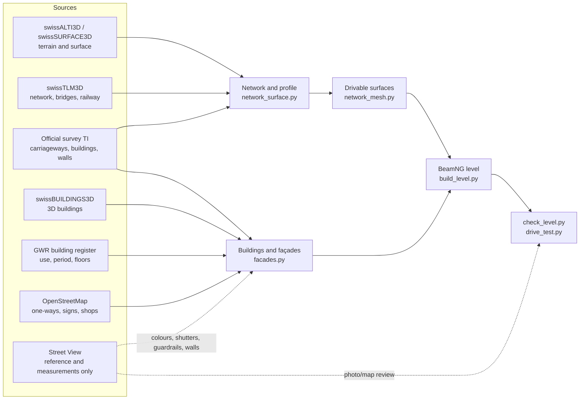

# Malcantone · BeamNG.drive

**The Malcantone (Canton Ticino, Switzerland) rebuilt at 1:1 scale for BeamNG.drive: 52 km² of villages, roads, trails, woods and lake between Ponte Tresa, Caslano, Agno, Bioggio, Gravesano and Arosio.**

The map is built by a Python pipeline from swisstopo open data, the official cadastral survey of Canton Ticino, the Federal Register of Buildings and OpenStreetMap. Google Street View panoramas are used only as a **visual reference**: poses, measurements, comparisons. No Street View image is in the repository or in the map; everything you see in the photos (façades, shutters, signs, guardrails, walls) is redrawn with original textures.

## At a glance

| | |
|---|---|
| **Area** | about 52 km², a 12.3 × 12.3 km terrain at 1.5 m (swissALTI3D LiDAR) |
| **Roads and trails** | 228 km of roads and 337 km of trails, mule tracks and stairways, all drivable; 167 bridges; since v2.2 also the pass above Gravesano to Arosio, the Ponte Tresa–Caslano cantonal road and Via Torrazza; since v2.4 asphalt, gravel, dirt, setts and cobblestones according to OpenStreetMap |
| **Buildings** | 12,792 buildings (swissBUILDINGS3D and the official survey) with façades, windows, shutters, doors, shop windows, plinths and chimneys |
| **Guardrails** | 2.0 km on the Magliaso–Pura cantonal road and, since v2.2, another 9.7 km on the rest of the network, wherever the panoramas show them |
| **Vegetation** | about 161,000 trees and shrubs from the surface model: all of them within 30 m of the roads, sparser further away; kept out of the roads' clearance envelope. Since v2.4 grass and flowers, palms in lakeside gardens, rows in 475 vineyards |
| **Water** | Lake Lugano and, since v2.4, the rivers (Magliasina, Vedeggio, Tresa and the other watercourses surveyed as areas) |
| **Markings** | lines, pedestrian crossings and markings detected in the 10 cm orthophoto, STOP and give-way signs, bus stops |
| **AI traffic** | complete network with one-way streets, roundabouts and dual carriageways |
| **Spawn points** | 30, one in every village |

## Gallery

> Renders of the built level, made without the game (`beamng/pipeline/screenshots.py`: three.js with the map's material textures). In BeamNG.drive the light, sky, vegetation and terrain are the game's own.

| | |
|---|---|
|  *Agno, the old town and the Collegiate Church* |  *Cademario* |
|  *Novaggio* |  *Ponte Tresa, the border bridge* |
|  *Bioggio and Manno, the Vedeggio plain* |  *Astano* |
|  *Sessa* |  *The pass above Gravesano towards Arosio (the Penudria)* |
|  *Caslano and Via Torrazza along the lake* |  *Magliaso, a street towards the old town* |
|  *The cantonal road towards Pura* |  *Agno, a street in the old town* |
|  *The pass above Gravesano towards Arosio* |  |

## What's new in v2.5

The first version measured inside BeamNG.drive (0.39.4, on a PC with 16 GB of RAM, RTX 4070). The v2.4 level loaded in 215 s
(371 s through BeamMP) and then wanted more memory than the PC had: minutes on the loading screen and the whole PC lagging.
v2.5 has the same geometry, built so that the game needs much less:

- **7916 → 2188 objects:** the 128 m blocks of buildings, walls, road surfaces, guardrails, water and vineyards are merged 3 × 3.
- **38.2 → 19.7 million vertices:** the meshes were written with three own vertices per triangle; now the triangles share them (positions and texture coordinates unchanged, checked).
- **Road edges:** the skirts and kerb faces along straight stretches with fewer triangles, within 4 mm (15.9 → 15.3 million triangles).
- **Detail by distance:** guardrails are no longer drawn beyond about 600 m, fences 400 m, painted markings 500 m, walls 1.2 km, vineyards 1 km, buildings and roads 3 km (before: up to 12 km). Sun shadows up to 800 m instead of 1600.
- **Result in the game:** 60 s to load once the game has converted the shapes (about 145 s the first time), 82–128 fps at the spawn points.

The game still needs about 12 GB of memory at its peak: on a 16 GB PC close other programs (browser, Discord, ...) before playing.

## What's new in v2.4

- **Houses visible from every side.** The game draws only one side of each wall. Up to v2.3, 8.6 % of the wall area faced inwards (L- and U-shaped buildings, courtyard buildings, rows of houses): from some angles the houses were transparent, with floating roofs. Now the facing of each wall is decided with a ray test and inverted walls drop to 0.06 %; where the facing can't be decided the wall is double-sided, and there are soffits under the eaves.
- **Magliaso roundabout, the climb towards Pura.** The "cube" sticking out of the asphalt at the junction was the top of a retaining wall covered by the road, which the map raised by 16 cm; the "square" in the middle of the carriageway was the kerb of the traffic island removed in 2022. Now the walls that the panoramas see as pavement are flush (487) or removed where the ground is flat (37), and that kerb is road.
- **Dirt, gravel and paving where they really are:** the OpenStreetMap surface (otherwise swissTLM3D's) on every road and trail: the survey's roads, previously all asphalt, now have 36 ha of dirt, 9.4 ha of gravel and 1.2 ha of setts and cobblestones in the old towns. Textures drawn with the colour measured on the orthophoto; in the game the grip changes too.
- **Grass and flowers** on the meadows and in the gardens around the camera, **palms** (352) in the gardens near the lake, **rows** in 475 vineyards (465 km, in the direction seen in the orthophoto), **water in the rivers** (30 ha, under the bridges too).
- **Materials and light:** ambient occlusion for render, plinths and roofs, walls darker towards the ground, street lamp light at night, a little more haze over the lake.

## What's new in v2.3

- **Magliaso, the cantonal road towards Pura at the junction with Via Piscicoltura.** For about 60 m, right after the junction, the carriageway tilted towards the wall that separates it from Via Piscicoltura, lower down: at the edge it was up to 2.2 m below the real ground, with a dip as if the asphalt had collapsed. The surface computation took that wall for a bump and merged the two roads into a single surface. Now the wall is recognised and each road sits at its own height: on the axis of the cantonal road the largest deviation from the real ground goes from 1.70 m to 0.09 m, on Via Piscicoltura from 0.53 m to 0.24 m. The virtual drive test no longer finds any twists or lifted wheels there (in v2.2: twist 9.6, wheels lifted by 21 cm). The same fix improves another stretch of the cantonal road towards Pura (about 1.3 km from Magliaso); along the whole 3.7 km the points more than 35 cm from the real ground go from 110 to 72.
- **Lighter woods to draw.** Up to v2.2 every measured tree within 150 m of a road was in the map: slopes crossed by hairpins, like the pass above Gravesano seen from the village, were as dense as the real forest and the game slowed down when looking at them. Now all the trees within 30 m of roads and 5 m of trails remain; further away the forest is thinned keeping the tallest ones (up to 100 m from the road the tallest in every square 11–17 m across, beyond that in every 32 m square). In total 160,748 trees and shrubs instead of 239,753 (−33 %); on the slope of the pass above Gravesano 40 % fewer (from 6,165 to 3,722 trees within 700 m). Along the roads, in the first 30 m, the forest is the same as before.

## What's new in v2.2

- **New roads.** The pass above Gravesano to Arosio (Stradón da Rós, the «Penudria», with its hairpins), the Ponte Tresa – Caslano – Magliaso cantonal road and Via Torrazza in Caslano ended at the edge of the map: beyond, there was only terrain. Now they are real roads (7.2 km more) with a 100 m corridor of buildings, trees and walls, reviewed on Street View like the rest.
- **Buildings with façades.** Up to v2.1 every building was a rendered volume with no openings. Now the buildings have a total of 165,533 openings (windows with shutters, roller blinds or modern frames, doors, gates, garages, shop windows, church and barn windows), 5,915 balconies, plinths and 3,348 chimneys, laid out by floor and bay according to the use, period and number of floors in the Federal Register of Buildings. Roofs in curved tiles, flat tiles, stone slabs, sheet metal or flat roofs. All textures are drawn by the pipeline: no photos.
- **Old towns house by house.** swissBUILDINGS3D merges rows of houses into a single block; now every house of the official survey has its own façades, floors, door and colour (4,508 houses in blocks). Floors start from the pavement on the street front, on slopes too.
- **Colours measured in the photos.** The render colour of 3,637 buildings, and the shutter colour where it is clear, come from the Street View panoramas (numerical values only).
- **Shop windows** where OpenStreetMap records a shop, bar or office (173 buildings), **garages** with doors, stone **rustici**.
- **Missing buildings:** 538 buildings of the official survey built after the 3D survey have been added; 14 demolished ones removed.
- **Guardrails across the whole network.** 326 guardrail stretches seen in the Street View panoramas; 9.7 km built on the road edge in addition to the 2.0 km on the Magliaso–Pura cantonal road, which up to v2.1 were the only ones.
- **Walls** with original stone, concrete and render textures; the material comes from the photos where it can be seen clearly.
- **Bus stops** from OpenStreetMap with pole, sign, timetable and shelter.
- **More drivable roads.** The surfaces are continuous between carriageway, pavements and yards and at junctions: the step between two roads that meet is spread over a few metres, while the main carriageways stay as they are. On the same roads as v2.1 the virtual drive test counts 62 % fewer steps on minor roads (1695 → 646) and 20 % fewer on main roads (74 → 59); wheels lifting off the road drop by 56 % on minor roads and 58 % on main roads, hard hits by 24 % and sharp twists by 58 % on minor roads.
- **No obstacles in the passages** under buildings: windows and plinths no longer hang over the road.

## Installation

1. Download `magliaso_pura_v2.5.zip` from the [releases](https://github.com/wintrymichi/magliasinaNG/releases) page.
2. Copy it to `Documents/BeamNG.drive/current/mods/` (or install it from the mod manager), removing previous versions: the level is always called `magliaso_pura`.
3. In the game: *Freeroam* → *Malcantone - Magliaso, Pura e dintorni*.

## How it's built

The level is rebuilt from scratch by the `.github/workflows/release_v2.4.yml` workflow (on a GitHub server, in about an hour): it downloads the official data, builds the level, checks it and publishes the release. Since v2.5 the mod zip then goes through `optimize_level.py` (merged blocks, shared vertices, detail by distance); the v2.5 release is the v2.4 release zip passed through it. The details of each step are in [`beamng/README.md`](beamng/README.md).

## Quality and verification

- **Automatic checks over the whole map** (`check_level.py`, [`beamng/verifica/check_level.json`](beamng/verifica/check_level.json)): terrain above the roads, holes, steps, seams between blocks, obstacles on the carriageway searched along every road and trail, trees in the clearance envelope, the AI network, missing files and, since v2.4, building walls facing inwards.
- **Virtual drive test** (`drive_test.py`): a car (a quarter-car model on all four wheels) drives every road in both directions and every trail, 670 km, on the level's surfaces as written. On the same roads as v2.1 the virtual drive test counts 66 % fewer steps on minor roads (1695 → 570) and 20 % fewer on main roads (74 → 59); wheels lifting off the road drop by 57 % on minor roads and 58 % on main roads, hard hits by 25 % and sharp twists by 61 % on minor roads.
- **Street View review** ([`beamng/verifica/REVISIONE.md`](beamng/verifica/REVISIONE.md)): for every road, the panorama coverage, the measured buildings, the guardrails and walls seen, the drive-test events before and after, and the places compared photo/map from the same camera, with the problems found and the fixes.

## Repository layout

| Path | Contents |
|---|---|
| [`beamng/pipeline/`](beamng/pipeline) | the pipeline: data download, road network, surfaces, buildings, façades, vegetation, level, checks |
| [`beamng/dati/`](beamng/dati) | lightweight results pinned for the release (poses, markings, guardrails, colours, GWR and OSM extracts) |
| [`beamng/verifica/`](beamng/verifica) | checks, drive test, road-by-road review, screenshots |
| [`beamng/RELEASE_v2.5.md`](beamng/RELEASE_v2.5.md) | release notes (earlier ones in [`beamng/RELEASE_v2.4.md`](beamng/RELEASE_v2.4.md), [`beamng/RELEASE_v2.3.md`](beamng/RELEASE_v2.3.md), [`beamng/RELEASE_v2.2.md`](beamng/RELEASE_v2.2.md)) |
| `panoramas.*`, `cameras.json`, `sv_capture.py`, … | the original dataset of the Magliaso–Pura cantonal road (panorama metadata, see below) |

## The panorama dataset

The project started from a dataset of Street View panoramas along the Strada Cantonale from Magliaso to Pura (45.981686, 8.878474 → 46.001760, 8.860159, 3.7 km, almost all from October 2022). **The images are not in the repository**: the `panorami/`, `viste/` and `storici_2013_2014/` folders (9.4 GB) stay local. The repository contains the metadata and the scripts to download them again.

| Folder / file | Contents |
|---|---|
| `panorami/` *(local only)* | 360° equirectangular panoramas, 6656 × 3328, one every ~10 m; named `NNNN_<panoId>.jpg` (NNNN = order along the road) |
| `viste/` *(local only)* | 16 perspective views per panorama (FOV 90°, 1600 × 1200): 8 directions × 2 tilts |
| `panoramas.csv` / `.json` | for each panorama: lat, lon, altitude, date, camera heading, pitch and roll, distance along the road |
| `panoramas.geojson` | panorama positions (opens in QGIS or on geojson.io) |
| `cameras.json` | for each view: file, GPS position, altitude, direction (yaw), pitch, FOV: known poses for photogrammetry |
| `panoramas_all_dates.json` | also the historical panoramas (2013/2014) of the same stretch, not downloaded |
| `sv_capture.py`, `expand.py`, `finalize.py` | the (re-runnable) scripts that download and prepare the images |

The views are named `NNNN_<panoId>_<direction>_p<pitch>.jpg`: the direction is relative to the direction of travel (`fwd`, `fwd_r`, `right`, `back_r`, `back`, `back_l`, `left`, `fwd_l`, in 45° steps), `p00` is the horizon and `p25` looks 25° upwards (façades, roofs, slopes).

**Coverage.** Almost all images are from October 2022; three panoramas from 2013 cover the spots where 2022 is missing. Between 1.28 and 1.36 km from the start (45.9858, 8.8692 → 45.9869, 8.8694) there is a gap of about 110 m with no panoramas on any nearby date. The pole and shadow of the Google car are visible at the bottom of the `p00` views towards `fwd`/`back`.

**3D reconstruction.** The `viste/` work with COLMAP, RealityCapture and Metashape (known intrinsics: fx = fy = 800 px, cx = 800, cy = 600, no distortion; the GPS positions in `cameras.json` serve as georeferencing); Metashape also accepts the spherical panoramas ("Spherical" camera); for Gaussian Splatting or NeRF go through the `viste/` with COLMAP first.

## Sources and licences

- © swisstopo: swissALTI3D, swissSURFACE3D, SWISSIMAGE, swissBUILDINGS3D 3.0, swissTLM3D, swissNAMES3D (open geodata of the Swiss Confederation).
- Official survey: Ufficio del catasto e dei riordini fondiari (Cadastre and Land Consolidation Office), Canton Ticino (geodienste.ch).
- Federal Register of Buildings and Dwellings (Federal Statistical Office).
- © OpenStreetMap contributors, ODbL 1.0: the extracts in `beamng/dati/osm_*.json.gz` are under the ODbL.
- Copernicus DEM GLO-30 (© DLR e.V. / Airbus, provided under COPERNICUS by the EU and ESA): distant landscape.
- Google Street View: visual reference only; no image is distributed.

## Known limitations

- Memory: the game needs about 12 GB at its peak (terrain and forest about 7 GB, the meshes the rest). On a 16 GB PC with other programs open it can still stall after loading; close them before playing.
- In the game (v2.5) only loading, memory and frame rate were measured, at the spawn points. The geometry checks are automatic (`check_level.py`, `drive_test.py`) and on renders of the level compared with the panoramas; the look of the grass (GroundCover), of the river water, of the paving and of the street lamp lights has not been reviewed in the game.
- The palms are an estimate (aerial photos can't tell a palm from a small tree); grass density and vineyard row spacing are not measured. Where OpenStreetMap gives no surface, swissTLM3D applies.
- With the walls turned the right way, the plinth of a few houses has also moved to the outside: the obstacle test counts 12 trail points blocked by buildings instead of 10. The one checked, below Pura, is a 1 m wide trail that enters an alley between terraced houses, now crossed low down by the plinth (about 60 cm).
- Façades: the number and position of windows, balconies and doors are plausible (use, period and floors from the register) but not copied one by one. The colour comes from the photos for 3,637 buildings; in shadow some colours come out wrong (a cream façade rendered pink). Exposed stone, arcades and storey-high plinths are not modelled.
- Yards of the official survey that straddle a change in height become steep ramps beside the road (for example on Via Torrazza in Caslano).
- Some swissBUILDINGS3D buildings have walls under only part of the roof (a shed in Pura).
- Guardrails and wall materials only where the panoramas see them; 736 walls without a reliable material stay stone.
- The drive test still reports spots to fix: the steep junction in Castelrotto, the parallel roads of Via Giuseppe Soldati, the bridge ends on Via Mondonico and Via Roncaccio, the level crossing on Via Grumo, the corridor edges; on the trails the events are almost unchanged.
- The new roads end at the edge of their 100 m corridor (beyond it, as elsewhere, there is only terrain): Arosio and Caslano are only partly included.
- Photo/map review: 116 places, 20 differences still to be checked (list in `beamng/dati/qa_review.json`).
