

# Malcantone · BeamNG.drive

**Il Malcantone (Canton Ticino) ricostruito in scala 1:1 per BeamNG.drive: 52 km² di paesi, strade, sentieri, boschi e lago tra Ponte Tresa, Caslano, Agno, Bioggio, Gravesano e Arosio.**

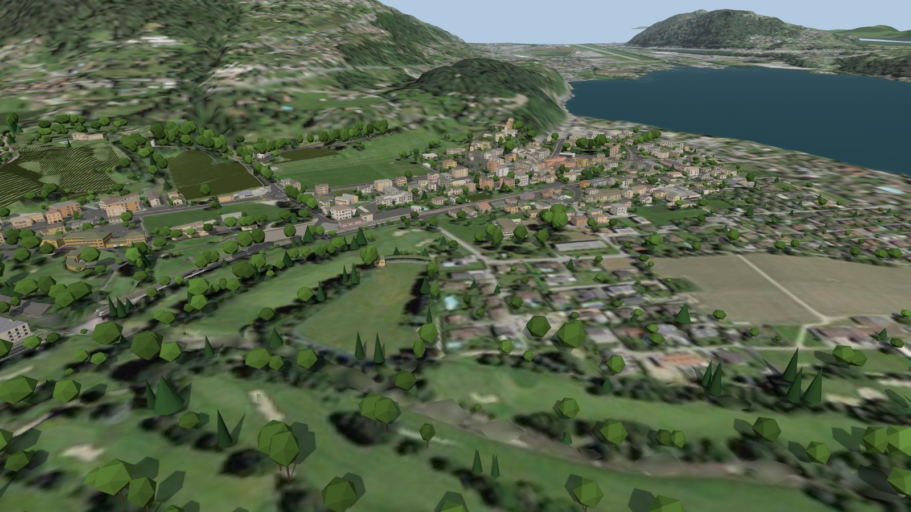

La mappa è costruita da una pipeline Python a partire dai dati aperti di swisstopo, dalla misurazione ufficiale del Cantone Ticino, dal Registro federale degli edifici e da OpenStreetMap. Le panoramiche Google Street View servono solo come **riferimento visivo**: pose, misure, confronti. Nessuna immagine Street View è nel repository o nella mappa; tutto ciò che si vede nelle foto (facciate, persiane, cartelli, guardrail, muri) è ridisegnato con texture originali.

## In breve

| | |
|---|---|
| **Area** | circa 52 km², terreno di 12,3 × 12,3 km a 1,5 m (LiDAR swissALTI3D) |
| **Strade e sentieri** | 228 km di strade e 337 km di sentieri, mulattiere e scalinate, tutti guidabili; 167 ponti; dalla v2.2 anche il passo sopra Gravesano fino ad Arosio, la cantonale Ponte Tresa–Caslano e Via Torrazza; dalla v2.4 asfalto, ghiaia, terra, cubetti e ciottoli secondo OpenStreetMap |
| **Edifici** | 12 792 edifici (swissBUILDINGS3D e misurazione ufficiale) con facciate, finestre, persiane, porte, vetrine, zoccoli e comignoli |
| **Guardrail** | 2,0 km sulla cantonale Magliaso–Pura e, dalla v2.2, altri 9,7 km sul resto della rete, dove le panoramiche li mostrano |
| **Vegetazione** | circa 161 000 alberi e arbusti dal modello di superficie: tutti quelli entro 30 m dalle strade, più radi lontano; fuori dalla sagoma libera delle strade. Dalla v2.4 erba e fiori, palme nei giardini sul lago, filari in 475 vigneti |
| **Acqua** | il Lago di Lugano e, dalla v2.4, i fiumi (Magliasina, Vedeggio, Tresa e gli altri corsi d'acqua rilevati come superfici) |
| **Segnaletica** | linee, strisce pedonali e segni rilevati nell'ortofoto 10 cm, cartelli STOP e precedenza, fermate dei bus |
| **Traffico IA** | rete completa con sensi unici, rotonde e carreggiate separate |
| **Punti di partenza** | 30, uno in ogni paese |

## Galleria

> Render del livello costruito, fatti senza il gioco (`beamng/pipeline/screenshots.py`: three.js con le texture dei materiali della mappa). In BeamNG.drive luce, cielo, vegetazione e terreno sono quelli del gioco.

| | |
|---|---|
| 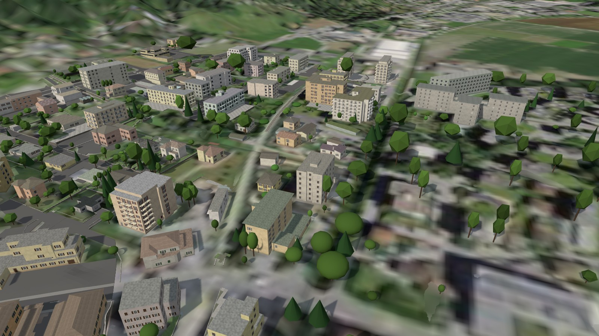 *Agno, il nucleo e la Collegiata* | 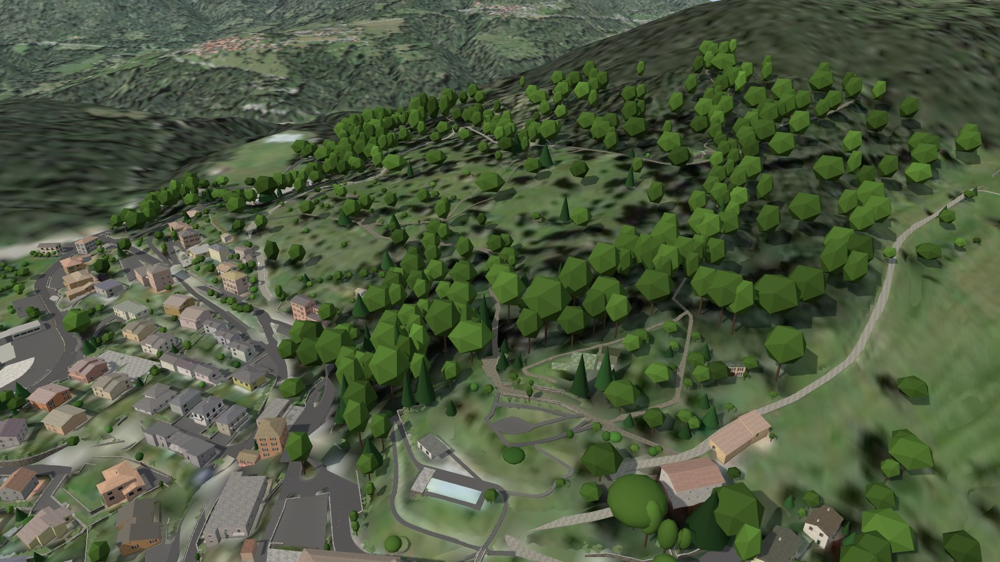 *Cademario* |
| 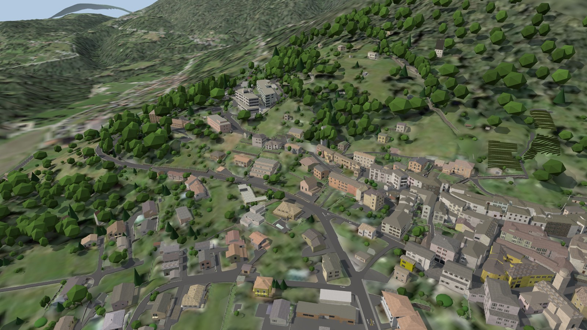 *Novaggio* | 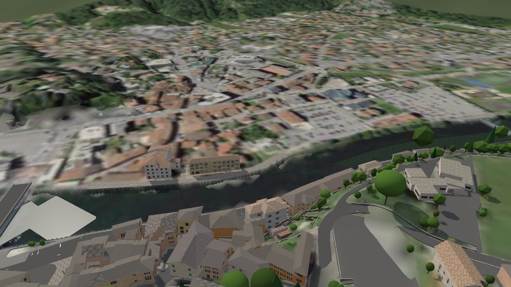 *Ponte Tresa, il ponte di confine* |
| 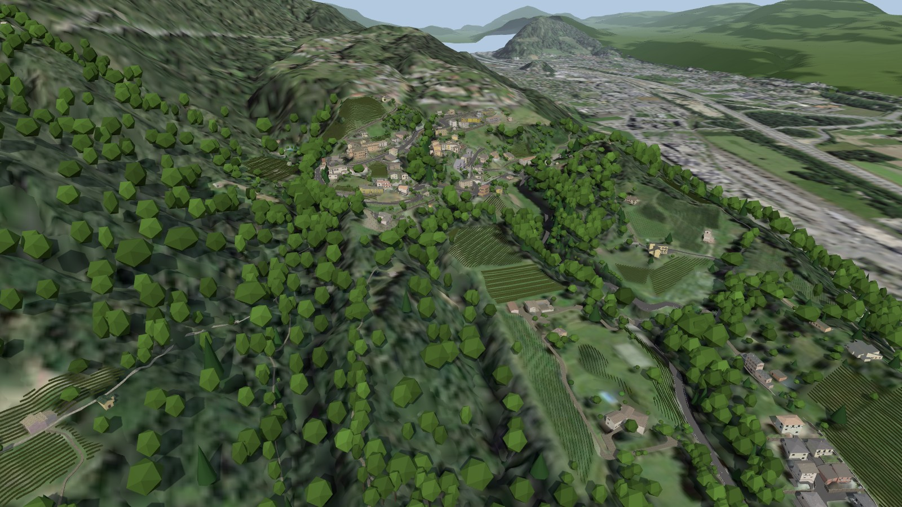 *Bioggio e Manno, piano del Vedeggio* | 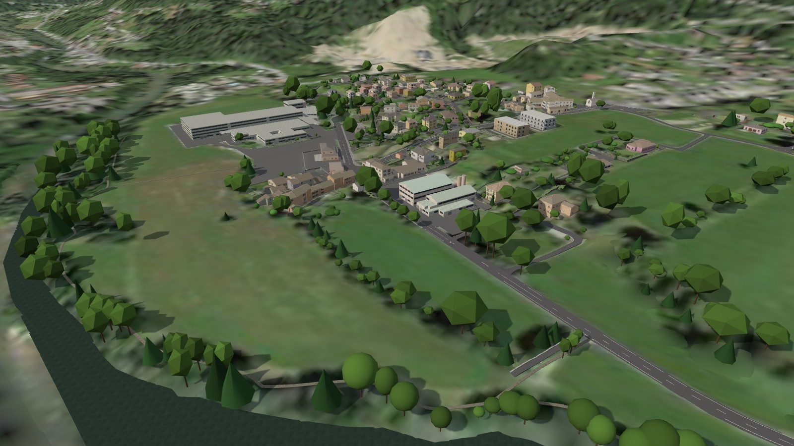 *Astano* |
| 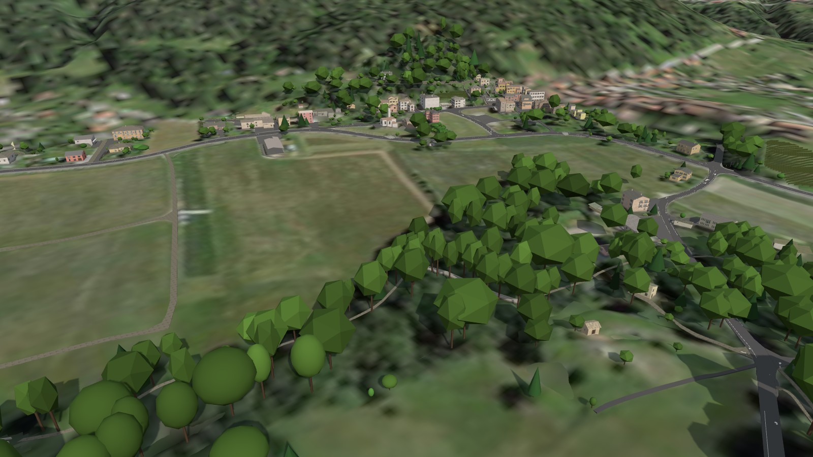 *Sessa* | 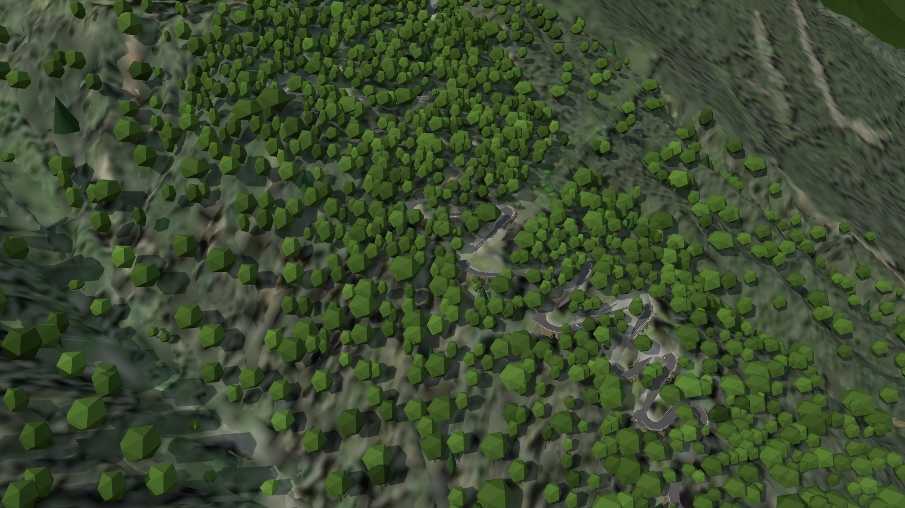 *Il passo sopra Gravesano verso Arosio (la Penudria)* |
| 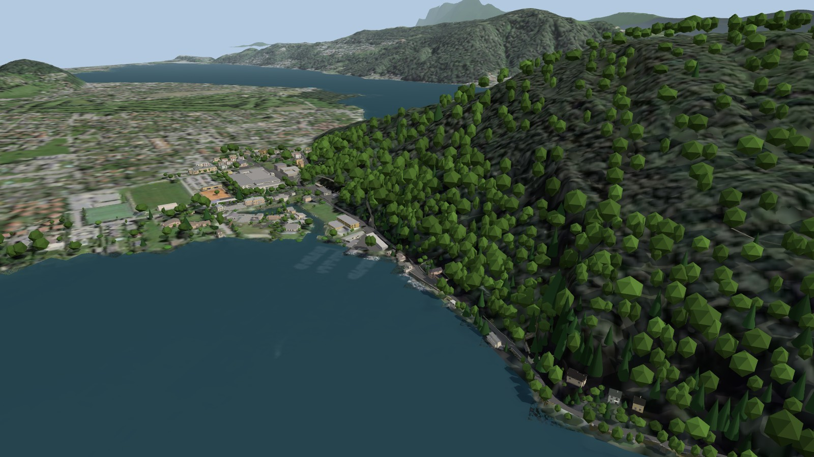 *Caslano e Via Torrazza lungo il lago* | 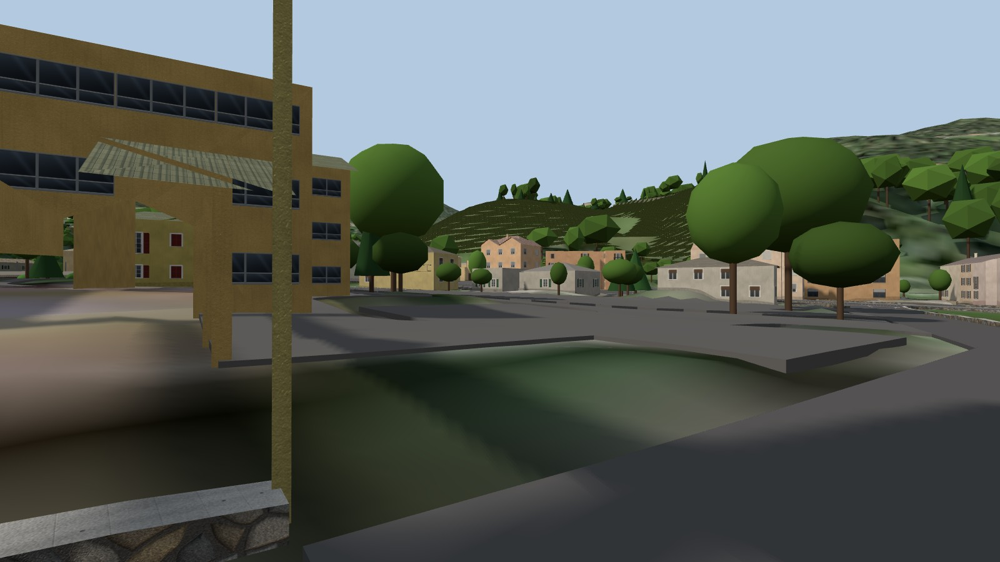 *Magliaso, via verso il nucleo* |
| 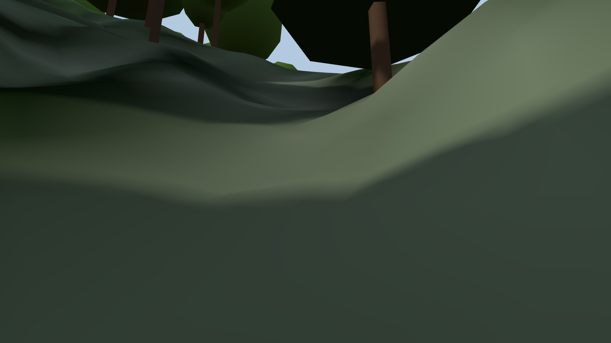 *La cantonale verso Pura* | 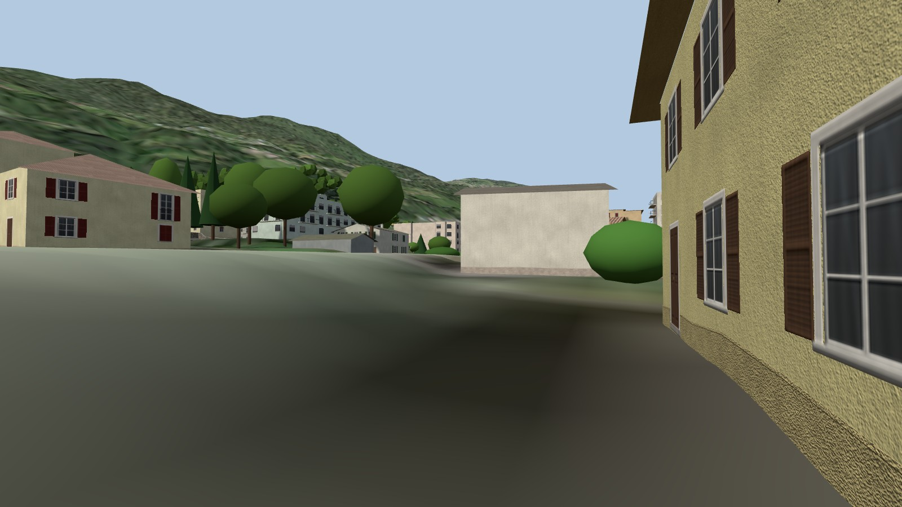 *Agno, una via del nucleo* |
| 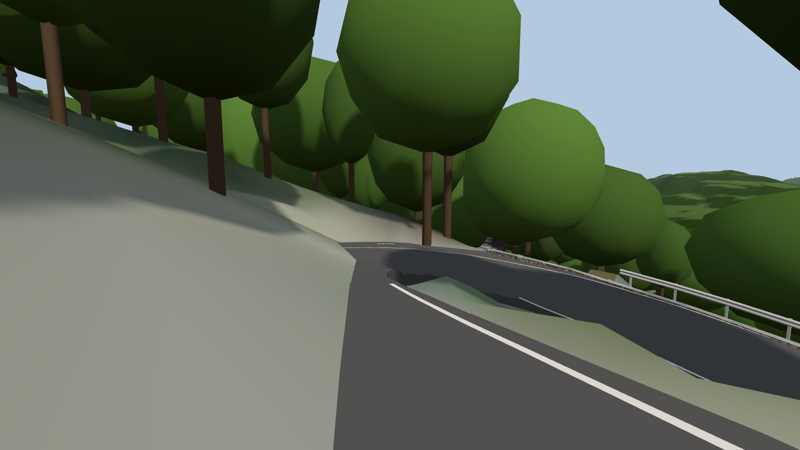 *Il passo sopra Gravesano verso Arosio* |  |

## Novità della v2.4

- **Case visibili da ogni lato.** Il gioco disegna una faccia sola di ogni parete. Fino alla v2.3 l'8,6 % della superficie delle pareti guardava verso l'interno (gli edifici a L, a U, a corte, le file di case): da certe angolazioni le case erano trasparenti, con i tetti sospesi. Ora il verso delle pareti si decide con un test dei raggi e le pareti girate scendono allo 0,06 %; dove il verso non si può decidere la parete ha due facce, e sotto le gronde c'è il sottotetto.
- **Rotonda di Magliaso, salita verso Pura.** Il "cubo" che sporgeva dall'asfalto all'incrocio era la cima di un muro di sostegno, coperto dalla strada, che la mappa alzava di 16 cm; il "quadrato" in mezzo alla carreggiata era il marciapiede dell'isola pedonale tolta nel 2022. Ora i muri che le panoramiche vedono come pavimentazione sono a filo (487) o tolti dove il terreno è in piano (37), e quel marciapiede è strada.
- **Sterrati, ghiaia e selciati dove lo sono davvero:** la superficie di OpenStreetMap (altrimenti di swissTLM3D) su ogni strada e sentiero: le strade della misurazione, prima tutte d'asfalto, hanno ora 36 ha di terra, 9,4 ha di ghiaia e 1,2 ha di cubetti e ciottoli nei nuclei. Texture disegnate con la tinta misurata sull'ortofoto; nel gioco cambia anche l'aderenza.
- **Erba e fiori** sui prati e nei giardini attorno alla telecamera, **palme** (352) nei giardini vicino al lago, **filari** in 475 vigneti (465 km, nella direzione dell'ortofoto), **acqua nei fiumi** (30 ha, anche sotto i ponti).
- **Materiali e luce:** ombre ambientali per intonaci, zoccoli e tetti, muri più scuri verso terra, luce dei lampioni di notte, un po' più di foschia sul lago.

## Novità della v2.3

- **Magliaso, la cantonale verso Pura all'incrocio con Via Piscicoltura.** Per circa 60 m, subito dopo l'incrocio, la carreggiata si piegava verso il muro che la separa da Via Piscicoltura, più in basso: sul bordo era fino a 2,2 m sotto il terreno reale, con un avvallamento come se l'asfalto fosse crollato. Il calcolo delle superfici prendeva quel muro per un dosso e univa le due strade in una superficie sola. Ora il muro è riconosciuto e ogni strada sta alla sua quota: sull'asse della cantonale lo scarto massimo dal terreno reale passa da 1,70 m a 0,09 m, su Via Piscicoltura da 0,53 m a 0,24 m. La prova di guida virtuale non trova più lì né torsioni né ruote staccate (nella v2.2: torsione 9,6, ruote staccate di 21 cm). La stessa correzione migliora un altro tratto della cantonale verso Pura (a circa 1,3 km da Magliaso); lungo tutti i 3,7 km i punti a più di 35 cm dal terreno reale passano da 110 a 72.
- **Boschi più leggeri da disegnare.** Fino alla v2.2 ogni albero misurato entro 150 m da una strada era nella mappa: i versanti attraversati da tornanti, come il passo sopra Gravesano visto dal paese, erano fitti come il bosco vero e il gioco rallentava guardandoli. Ora restano tutti gli alberi entro 30 m dalle strade e 5 m dai sentieri; più lontano il bosco è diradato tenendo i più alti (fino a 100 m dalla strada il più alto in ogni quadrato di 11–17 m di lato, oltre in ogni quadrato di 32 m). In tutto 160 748 alberi e arbusti invece di 239 753 (−33 %); sul versante del passo sopra Gravesano il 40 % in meno (da 6 165 a 3 722 alberi nei 700 m attorno). Lungo le strade, nei primi 30 m, il bosco è quello di prima.

## Novità della v2.2

- **Strade nuove.** Il passo sopra Gravesano fino ad Arosio (Stradón da Rós, la «Penudria», con i suoi tornanti), la cantonale Ponte Tresa – Caslano – Magliaso e Via Torrazza a Caslano finivano sul bordo della mappa: oltre c'era solo il terreno. Ora sono strade vere (7,2 km in più) con un corridoio di 100 m di edifici, alberi e muri, riviste su Street View come il resto.
- **Edifici con le facciate.** Fino alla v2.1 ogni edificio era un volume intonacato senza aperture. Ora gli edifici hanno in tutto 165 533 aperture (finestre con persiane, tapparelle o serramenti moderni, porte, portoni, garage, vetrine, finestre di chiese e stalle), 5 915 balconi, zoccoli e 3 348 comignoli, distribuiti per piani e campate secondo uso, epoca e numero di piani del Registro federale degli edifici. Coperture in coppi, tegole, piode, lamiera o tetto piano. Tutte le texture sono disegnate dalla pipeline: nessuna foto.
- **Nuclei dei paesi casa per casa.** swissBUILDINGS3D unisce le file di case in un solo blocco; ora ogni casa della misurazione ufficiale ha le sue facciate, i suoi piani, la sua porta e il suo tono (4 508 case in blocchi). I piani partono dal marciapiede del fronte strada, anche sui pendii.
- **Colori misurati nelle foto.** Il tono dell'intonaco di 3 637 edifici e il colore delle persiane dove è chiaro vengono dalle panoramiche Street View (solo i valori numerici).
- **Vetrine** dove OpenStreetMap registra un negozio, un bar o un ufficio (173 edifici), **garage** con le porte, **rustici** in pietra.
- **Edifici mancanti:** 538 edifici della misurazione ufficiale costruiti dopo il rilievo 3D sono stati aggiunti; 14 demoliti tolti.
- **Guardrail su tutta la rete.** 326 tratti di guardrail visti nelle panoramiche Street View; 9,7 km costruiti sul bordo della strada oltre ai 2,0 km della cantonale Magliaso–Pura, che fino alla v2.1 erano gli unici.
- **Muri** con texture originali di pietra, calcestruzzo e intonaco; il materiale viene dalle foto dove si vede bene.
- **Fermate dei bus** di OpenStreetMap con palo, cartello, orario e pensilina.
- **Strade più guidabili.** Le superfici sono continue tra carreggiata, marciapiedi e piazzali e agli incroci: il salto tra due strade che si incontrano viene distribuito su qualche metro, le carreggiate principali restano come sono. Sulle stesse strade della v2.1 la prova di guida virtuale conta il 62 % di gradini in meno sulle strade secondarie (1695 → 646) e il 20 % in meno sulle principali (74 → 59); le ruote che si staccano dalla strada calano del 56 % sulle secondarie e del 58 % sulle principali, i colpi forti del 24 % e le torsioni brusche del 58 % sulle secondarie.
- **Nessun ostacolo nei passaggi** sotto gli edifici: finestre e zoccoli non restano sospesi sopra la strada.

## Installazione

1. Scaricare `magliaso_pura_v2.4.zip` dalla pagina delle [release](https://github.com/wintrymichi/magliasinaNG/releases).
2. Copiarlo in `Documents/BeamNG.drive/current/mods/` (o installarlo dal gestore delle mod), togliendo le versioni precedenti: il livello si chiama sempre `magliaso_pura`.
3. Nel gioco: *Freeroam* → *Malcantone - Magliaso, Pura e dintorni*.

## Come è costruita

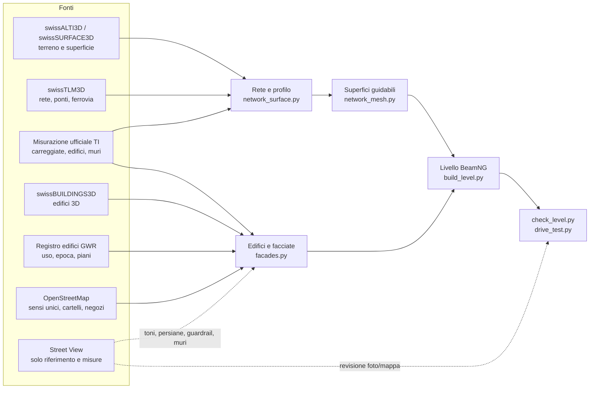

Il livello si ricostruisce da zero con il workflow `.github/workflows/release_v2.4.yml` (su un server GitHub, in circa un'ora): scarica i dati ufficiali, costruisce il livello, lo controlla e pubblica la release. I dettagli di ogni passo sono in [`beamng/README.md`](beamng/README.md).

## Qualità e verifica

- **Controlli automatici su tutta la mappa** (`check_level.py`, [`beamng/verifica/check_level.json`](beamng/verifica/check_level.json)): terreno sopra le strade, buchi, gradini, giunzioni tra blocchi, ostacoli sulla carreggiata cercati lungo ogni strada e sentiero, alberi nella sagoma libera, rete dell'IA, file mancanti e, dalla v2.4, pareti degli edifici girate verso l'interno.
- **Prova di guida virtuale** (`drive_test.py`): un'auto (modello quarter-car sulle quattro ruote) percorre tutte le strade nei due sensi e tutti i sentieri, 670 km, sulle superfici del livello come sono scritte. Sulle stesse strade della v2.1 la prova di guida virtuale conta il 66 % di gradini in meno sulle strade secondarie (1695 → 570) e il 20 % in meno sulle principali (74 → 59); le ruote che si staccano dalla strada calano del 57 % sulle secondarie e del 58 % sulle principali, i colpi forti del 25 % e le torsioni brusche del 61 % sulle secondarie.
- **Revisione su Street View** ([`beamng/verifica/REVISIONE.md`](beamng/verifica/REVISIONE.md)): per ogni strada la copertura delle panoramiche, gli edifici misurati, i guardrail e i muri visti, gli eventi della prova di guida prima e dopo, e i luoghi confrontati foto/mappa dalla stessa camera con i problemi trovati e le correzioni.

## Struttura del repository

| Percorso | Contenuto |
|---|---|
| [`beamng/pipeline/`](beamng/pipeline) | la pipeline: download dei dati, rete stradale, superfici, edifici, facciate, vegetazione, livello, controlli |
| [`beamng/dati/`](beamng/dati) | risultati leggeri fissati per la release (pose, segnaletica, guardrail, colori, estratti di GWR e OSM) |
| [`beamng/verifica/`](beamng/verifica) | controlli, prova di guida, revisione strada per strada, screenshot |
| [`beamng/RELEASE_v2.4.md`](beamng/RELEASE_v2.4.md) | note della release (quelle precedenti in [`beamng/RELEASE_v2.3.md`](beamng/RELEASE_v2.3.md), [`beamng/RELEASE_v2.2.md`](beamng/RELEASE_v2.2.md)) |
| `panoramas.*`, `cameras.json`, `sv_capture.py`, … | il dataset originale della cantonale Magliaso–Pura (metadati delle panoramiche, vedi sotto) |

## Il dataset delle panoramiche

Il progetto è nato da un dataset di panoramiche Street View lungo la Strada Cantonale da Magliaso a Pura (45.981686, 8.878474 → 46.001760, 8.860159, 3,7 km, quasi tutte di ottobre 2022). **Le immagini non sono nel repository**: le cartelle `panorami/`, `viste/` e `storici_2013_2014/` (9,4 GB) restano in locale. Il repository contiene i metadati e gli script con cui si riscaricano.

| Cartella / file | Contenuto |
|---|---|
| `panorami/` *(solo in locale)* | panoramiche 360° equirettangolari, 6656 × 3328, una ogni ~10 m; nome `NNNN_<panoId>.jpg` (NNNN = ordine lungo la strada) |
| `viste/` *(solo in locale)* | 16 viste prospettiche per panoramica (FOV 90°, 1600 × 1200): 8 direzioni × 2 inclinazioni |
| `panoramas.csv` / `.json` | per ogni panoramica: lat, lon, quota, data, heading, pitch e roll della camera, distanza lungo la strada |
| `panoramas.geojson` | posizioni delle panoramiche (si apre in QGIS o su geojson.io) |
| `cameras.json` | per ogni vista: file, posizione GPS, quota, direzione (yaw), pitch, FOV: pose note per la fotogrammetria |
| `panoramas_all_dates.json` | anche le panoramiche storiche (2013/2014) dello stesso tratto, non scaricate |
| `sv_capture.py`, `expand.py`, `finalize.py` | gli script (rieseguibili) che scaricano e preparano le immagini |

Le viste si chiamano `NNNN_<panoId>_<direzione>_p<pitch>.jpg`: la direzione è relativa al senso di marcia (`fwd`, `fwd_r`, `right`, `back_r`, `back`, `back_l`, `left`, `fwd_l`, a passi di 45°), `p00` è l'orizzonte e `p25` guarda 25° verso l'alto (facciate, tetti, versanti).

**Copertura.** Quasi tutte le immagini sono di ottobre 2022; tre panoramiche del 2013 coprono i punti dove il 2022 manca. Tra 1,28 e 1,36 km dall'inizio (45.9858, 8.8692 → 45.9869, 8.8694) c'è un buco di circa 110 m senza panoramiche in nessuna data vicina. La barra e l'ombra dell'auto di Google si vedono in basso nelle viste `p00` verso `fwd`/`back`.

**Ricostruzione 3D.** Le `viste/` vanno bene per COLMAP, RealityCapture e Metashape (intrinseci noti: fx = fy = 800 px, cx = 800, cy = 600, nessuna distorsione; le posizioni GPS di `cameras.json` servono da georeferenziazione); Metashape accetta anche le panoramiche sferiche (camera "Spherical"); per Gaussian Splatting o NeRF si passa prima dalle `viste/` con COLMAP.

## Fonti e licenze

- © swisstopo: swissALTI3D, swissSURFACE3D, SWISSIMAGE, swissBUILDINGS3D 3.0, swissTLM3D, swissNAMES3D (dati geografici aperti della Confederazione).
- Misurazione ufficiale: Ufficio del catasto e dei riordini fondiari, Cantone Ticino (geodienste.ch).
- Registro federale degli edifici e delle abitazioni (Ufficio federale di statistica).
- © OpenStreetMap contributors, ODbL 1.0: gli estratti in `beamng/dati/osm_*.json.gz` sono sotto la ODbL.
- Copernicus DEM GLO-30 (© DLR e.V. / Airbus, fornito nell'ambito di COPERNICUS da UE ed ESA): paesaggio lontano.
- Google Street View: solo riferimento visivo; nessuna immagine è distribuita.

## Limiti noti

- La mappa non è stata provata dentro BeamNG.drive durante questa revisione: le verifiche sono automatiche (`check_level.py`, `drive_test.py`) e sui render del livello confrontati con le panoramiche. Della v2.4 non sono provati nel gioco l'aspetto e il costo dell'erba (GroundCover), la trasparenza dell'acqua dei fiumi, il fondo dei selciati e le luci dei lampioni.
- Le palme sono una stima (le foto aeree non distinguono una palma da un piccolo albero); la densità dell'erba e la distanza dei filari non sono misurate. Dove OpenStreetMap non indica la superficie vale swissTLM3D.
- Con le pareti girate dal lato giusto anche lo zoccolo di qualche casa è passato sul lato esterno: la prova degli ostacoli conta 12 punti di sentiero bloccati da edifici invece di 10. Quello controllato, sotto Pura, è un sentiero largo 1 m che entra in un vicolo tra case a schiera, ora attraversato in basso dallo zoccolo (circa 60 cm).
- Facciate: numero e posizione di finestre, balconi e porte sono plausibili (uso, epoca e piani del registro) ma non copiati uno per uno. Il tono viene dalle foto per 3 637 edifici; in ombra alcune tinte escono sbagliate (una facciata crema resa rosa). Pietra a vista, portici e zoccoli alti un piano non sono modellati.
- Piazzali della misurazione ufficiale che scavalcano un salto di quota diventano rampe ripide accanto alla strada (per esempio in Via Torrazza a Caslano).
- Alcuni edifici di swissBUILDINGS3D hanno i muri solo sotto una parte del tetto (un capannone a Pura).
- Guardrail e materiale dei muri solo dove le panoramiche li vedono; 736 muri senza un materiale sicuro restano in pietra.
- La prova di guida segnala ancora punti da sistemare: l'incrocio ripido di Castelrotto, le strade parallele di Via Giuseppe Soldati, le estremità dei ponti di Via Mondonico e Via Roncaccio, il passaggio a livello di Via Grumo, i bordi dei corridoi; sui sentieri gli eventi sono quasi invariati.
- Le strade nuove finiscono al bordo del loro corridoio di 100 m (oltre, come altrove, c'è solo il terreno): Arosio e Caslano sono compresi solo in parte.
- Revisione foto/mappa: 116 luoghi, 20 differenze ancora da verificare (elenco in `beamng/dati/qa_review.json`).
