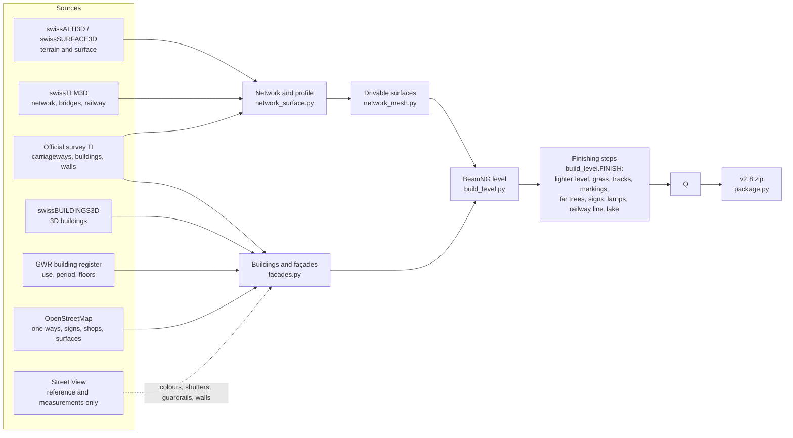

<div align="center">

# Malcantone · BeamNG.drive

**The Malcantone (Canton Ticino, Switzerland) rebuilt at 1:1 scale for BeamNG.drive: 52 km² of villages, roads, trails, woods and lake between Ponte Tresa, Caslano, Agno, Bioggio, Gravesano and Arosio.**


</div>

The Malcantone is the hilly corner of Ticino west of Lugano, between Lake Lugano and the Italian border. This mod turns about 52 km² of it into a drivable BeamNG.drive map: every real road and trail, every building, the woods and the lake, all at their real position and height.

Nothing is modelled by hand. A Python pipeline builds the whole map from open data: swisstopo (terrain, roads, buildings, aerial photos), the official cadastral survey of Canton Ticino, the Federal Register of Buildings and OpenStreetMap. Google Street View panoramas are used only as a **visual reference** (poses, measurements, comparisons). No Street View image is in the repository or in the map: everything you see in the photos (façades, shutters, signs, guardrails, walls) is redrawn with original textures.

**Contents:** [Quick start](#quick-start) · [Where to drive](#where-to-drive) · [Troubleshooting](#troubleshooting) · [At a glance](#at-a-glance) · [Gallery](#gallery) · [How the map is made](#how-the-map-is-made) · [Quality and verification](#quality-and-verification) · [Known limitations](#known-limitations) · [Repository layout](#repository-layout) · [Where to read more](#where-to-read-more) · [The panorama dataset](#the-panorama-dataset) · [Sources and licences](#sources-and-licences)

## Quick start

1. **Download** `magliaso_pura_v2.7.zip` from the [latest release](https://github.com/wintrymichi/magliasinaNG/releases/latest).
2. **Install it:** copy the zip, without unpacking it, to `Documents/BeamNG.drive/current/mods/` (or add it from the game's mod manager).
3. **Remove older versions** of the map from the same folder (`magliaso_pura_v2.x.zip`). Every version uses the same level name, `magliaso_pura`, so two zips in the folder conflict.
4. **Play:** in the game choose *Freeroam* → *Malcantone - Magliaso, Pura e dintorni*. You start at the Magliaso junction, at the foot of the cantonal road to Pura.

**What you need:** BeamNG.drive 0.39. v2.7 was measured on BeamNG.drive 0.39 with 16 GB of RAM and an RTX 4070 at 2560 × 1440: 74–131 fps at the test views. The game uses about 12 GB of memory at its peak, so 16 GB is the practical minimum.

**Loading time:** the first time takes about 155 s, because the game converts the map's shapes and tree pictures and keeps them in its cache. After that it loads in about 70 s.

## Where to drive

The map has 30 spawn points. Pick one in the game's spawn menu once the level is loaded.

| Spawn point | Where it puts you |
|---|---|
| `spawn_magliaso` (default) | the Magliaso junction, facing up the cantonal road to Pura |
| `spawn_mid` | halfway up the Magliaso–Pura cantonal road |
| `spawn_pura` | the top of the cantonal road, 160 m from Curio |
| one per village | `spawn_agno`, `spawn_aranno`, `spawn_arosio`, `spawn_astano`, `spawn_banco`, `spawn_bedigliora`, `spawn_bioggio`, `spawn_bosco_luganese`, `spawn_breno`, `spawn_cademario`, `spawn_caslano`, `spawn_cassina_d_agno`, `spawn_castelrotto`, `spawn_cimo`, `spawn_gravesano`, `spawn_magliaso_paese`, `spawn_manno`, `spawn_miglieglia`, `spawn_molinazzo_di_monteggio`, `spawn_monteggio`, `spawn_neggio`, `spawn_novaggio`, `spawn_ponte_tresa`, `spawn_pura_paese`, `spawn_purasca`, `spawn_sessa`, `spawn_vernate` |

A few drives to start with:

- **Magliaso → Pura**, the Strada Cantonale (3.7 km). This is where the project began, and the most detailed road on the map: markings, signs, street lamps and walls placed from the panoramas.
- **Along the lake**, from Magliaso on the Strada Regina to Agno, then through Bioggio and Manno to Gravesano (8.8 km).
- **The Penudria**, the hairpin pass from Gravesano up to Arosio (Stradón da Rós).
- **Caslano and Via Torrazza**, the narrow lakeside road to the Torrazza, and the border bridge at Ponte Tresa.
- **Off the asphalt:** every trail, mule track, forest road and stairway in the area has a solid surface. Since v2.4 gravel, dirt, setts and cobblestones also change the grip.

AI traffic works on the whole road network, with one-way streets, roundabouts and dual carriageways. Roads closed to traffic are avoided.

## Troubleshooting

| Problem | What to do |
|---|---|
| The game stalls after loading, or the whole PC lags | The map needs about 12 GB at its peak. Close the browser, Discord and other programs before loading it. |
| The level is missing from the Freeroam list, or loads the wrong version | Check that only one `magliaso_pura_v*.zip` is in the `mods` folder and that it is still zipped. |
| The first load is slow | That is normal: the game converts the shapes once (about 155 s), then loads in about 70 s. |
| After updating, parts of the map still look like the old version | The game may still show shapes it converted for the old zip. Delete the `temp/levels/magliaso_pura/` folder in the game's user folder (the one that holds `mods`) and load the level again. |
| Low frame rate in meadows and gardens | The grass is the game's own groundcover: lower the vegetation quality in the game's graphics settings. |
| A road ends in the middle of nowhere | Some roads leave the modelled area and stop at its edge; beyond it there is only terrain. See [Known limitations](#known-limitations). |

Found something wrong on the map? Open an [issue](https://github.com/wintrymichi/magliasinaNG/issues) with the place (village and road) and, if you can, a screenshot.

## At a glance

| | |
|---|---|
| **Area** | about 52 km², a 12.3 × 12.3 km terrain at 1.5 m (swissALTI3D LiDAR) |
| **Roads and trails** | 228 km of roads and 337 km of trails, mule tracks and stairways, all drivable; 167 bridges; since v2.2 also the pass above Gravesano to Arosio, the Ponte Tresa–Caslano cantonal road and Via Torrazza; since v2.4 asphalt, gravel, dirt, setts and cobblestones according to OpenStreetMap; since v2.7 dirt and gravel tracks flush with the ground |
| **Buildings** | 12,792 buildings (swissBUILDINGS3D and the official survey) with façades, windows, shutters, doors, shop windows, plinths and chimneys |
| **Guardrails** | 2.0 km on the Magliaso–Pura cantonal road and, since v2.2, another 9.7 km on the rest of the network, wherever the panoramas show them |
| **Vegetation** | every tree measured in the surface model: about 161,000 trees and shrubs with the game's models near the roads, and since v2.7 another 201,634 lighter drawn trees on the slopes further away; kept out of the roads' clearance envelope. Grass and flowers with the game's own textures (v2.6), palms in lakeside gardens, rows in 475 vineyards |
| **Water** | Lake Lugano and, since v2.4, the rivers (Magliasina, Vedeggio, Tresa and the other watercourses surveyed as areas) |
| **Markings** | detected in the 10 cm orthophoto and, since v2.7, redrawn as they are painted in Switzerland: 4,240 strips (62.7 km), smooth lines, regular dashes, standard yellow pedestrian crossings |
| **Road signs** | since v2.7 Swiss signs on the whole network (286 new: crossings, roundabouts, one-way streets, zones, speed limits, village limits, signs mapped in OpenStreetMap), plus STOP and give-way signs, bus stops and the cantonal road's plates |
| **AI traffic** | complete network with one-way streets, roundabouts and dual carriageways |
| **Spawn points** | 30, one in every village |

## Gallery

### New in v2.7

> In-game screenshots of the v2.7 level (BeamNG.drive 0.39, driver's eye height): Swiss road signs, markings redrawn to the Swiss standard, dirt tracks flush with the ground, wooded slopes. More in [`beamng/verifica/screenshots/v2.7/`](beamng/verifica/screenshots/v2.7).

| | |
|---|---|
| <br>*Road signs: roundabout entry* | <br>*Road signs: the 50 "generale" into Magliaso* |
| <br>*Cantonal road: zone 30 with the 16 t limit, as in the photos* | <br>*Markings: Swiss pedestrian crossing and arrows* |
| <br>*Markings: dashes at one length and period* | <br>*Markings: roundabout* |
| <br>*Dirt track above Arosio, flush with the ground* | <br>*Gravel track at Cademario* |
| <br>*Far trees: the pass above Gravesano from the village* | <br>*Far trees: the Malcantone from the lake* |

### v2.6

> Screenshots taken in BeamNG.drive 0.39 on the v2.6 level, at the same views as the earlier renders (`beamng/pipeline/run_readme_screenshots.ps1`: free camera, no HUD, the game's own light, sky, vegetation and terrain).

| | |
|---|---|
| <br>*Agno, the old town and the Collegiate Church* | <br>*Cademario* |
| <br>*Novaggio* | <br>*Ponte Tresa, seen from across the border* |
| <br>*Bioggio and Manno, the Vedeggio plain* | <br>*Astano* |
| <br>*Sessa* | <br>*The pass above Gravesano towards Arosio (the Penudria)* |
| <br>*Caslano and Via Torrazza along the lake* | <br>*Magliaso, a street towards the old town* |
| <br>*The cantonal road towards Pura* | <br>*Agno, a street in the old town* |
| <br>*The pass above Gravesano towards Arosio* |  |

## How the map is made

The map is rebuilt from scratch from the data every time: there is no hand-edited level file. In short:

1. **Download the official data** for the area: terrain and surface models, aerial photos, the road network, the cadastral survey, 3D buildings, the building register, OpenStreetMap.
2. **Build the road network.** Every road and trail line is re-centred on the surveyed carriageway, and one least-squares fit computes a smooth height profile for the whole network, so heights match at every junction and gradients are the real ones.
3. **Lay the drivable surfaces** (carriageways, pavements, yards, trails) and carve the terrain 10 cm under them, so it never pokes through a road.
4. **Add everything else:** buildings with drawn façades, walls, bridges, guardrails, road markings detected in the 10 cm aerial photo, trees from the surface model, grass, rivers and the lake, the railway, signs and bus stops.
5. **Write the BeamNG level** with spawn points and the AI road network.
6. **Check it automatically** (`check_level.py`, `drive_test.py`). If the checks fail, no release is published.
7. **Finish it** (`build_level.FINISH`, since v2.8 all inside the build): make it lighter for the game (`optimize_level.py`), add the game's grass, lay the tracks and the paved edges flush, redraw the markings, bring back the far trees, put up the road signs, shade the ground behind the walls, add the undergrowth, the street lamps (lit at night), delineators and pole lines, the railway's overhead line, the piers and boats, and the gutters, aerials and solar panels of the houses.



**How a release is built.** The [`release_v2.8.yml`](.github/workflows/release_v2.8.yml) workflow builds the level from scratch on a GitHub server (*Actions* → *Release v2.8* → *Run workflow*): it downloads the data, builds the level with every finishing step, runs the checks and publishes the zip. Up to v2.8 the versions after v2.4 were patch scripts run on the previous zip; since v2.8 those steps are part of the build itself (`build_level.FINISH`), and [`v28_build_test.yml`](.github/workflows/v28_build_test.yml) makes the same zip for the test in the game.

```bash
cd beamng/pipeline
python build_level.py                          # the whole level, with the finishing steps
python build_level.py --finish lamps signs     # only some finishing steps, again, on the built level
python package.py magliaso_pura_v2.8           # the mod zip and its digest
```

How to run the pipeline yourself, the environment variables, the coordinate system and the role of every script are in [`beamng/README.md`](beamng/README.md).

**Where the numbers come from.** Coordinates are Swiss LV95 shifted to a local origin in the map (1 unit = 1 m), and heights are the real ones above sea level. The Street View panoramas never enter the map: from them the pipeline only takes numbers, like a façade colour, whether a guardrail is there, or what a wall is made of.

## Quality and verification

- **Automatic checks over the whole map** (`check_level.py`, results in [`beamng/verifica/check_level.json`](beamng/verifica/check_level.json)): terrain above the roads, holes, steps, seams between blocks, obstacles on the carriageway searched along every road and trail, trees in the clearance envelope, the AI network, missing files and, since v2.4, building walls facing inwards.
- **Virtual drive test** (`drive_test.py`, [`beamng/verifica/drive_test.json`](beamng/verifica/drive_test.json)): a simulated car (a quarter-car model on all four wheels) drives every road in both directions and every trail, 670 km, on the level's surfaces as written. On the same roads as v2.1 it counts 66 % fewer steps on minor roads (1695 → 570) and 20 % fewer on main roads (74 → 59); wheels lifting off the road drop by 57 % on minor roads and 58 % on main roads, hard hits by 25 % and sharp twists by 61 % on minor roads.
- **Street View review** ([`beamng/verifica/REVISIONE.md`](beamng/verifica/REVISIONE.md)): for every road, the panorama coverage, the measured buildings, the guardrails and walls seen, the drive-test events before and after, and the places compared photo/map from the same camera, with the problems found and the fixes.
- **In the game** (since v2.5): loading time, memory and frame rate measured in BeamNG.drive 0.39 at the spawn points, for v2.6 on meadows and gardens, and for v2.7 at the test views of the signs, markings, tracks and slopes, with every kind of sign checked from the traffic ([`beamng/verifica/screenshots/v2.7/test.json`](beamng/verifica/screenshots/v2.7/test.json)).

## Known limitations

Each limitation has an issue where the details, the places and the possible fix are tracked.

| Limitation | Issue |
|---|---|
| The game needs about 12 GB of memory at its peak (terrain and forest about 7 GB, the meshes the rest). On a 16 GB PC with other programs open it can still stall after loading. | [#31](https://github.com/wintrymichi/magliasinaNG/issues/31) |
| Not yet reviewed in the game: the river water, the grip of the paving, the street lamp lights at night. | [#8](https://github.com/wintrymichi/magliasinaNG/issues/8) |
| Palms, grass density and vineyard row spacing are estimates. Where OpenStreetMap gives no surface, swissTLM3D applies. | [#9](https://github.com/wintrymichi/magliasinaNG/issues/9) |
| The plinth of a few houses blocks a trail (12 blocked trail points instead of 10, for example in an alley below Pura). | [#10](https://github.com/wintrymichi/magliasinaNG/issues/10) |
| Façades: windows, balconies and doors are plausible but not copied one by one; some colours measured in shadow are wrong; exposed stone, arcades and storey-high plinths are not modelled. | [#11](https://github.com/wintrymichi/magliasinaNG/issues/11) |
| Yards on two levels become steep ramps beside the road (for example in Caslano). | [#12](https://github.com/wintrymichi/magliasinaNG/issues/12) |
| Some buildings have walls under only part of the roof (a shed in Pura). | [#13](https://github.com/wintrymichi/magliasinaNG/issues/13) |
| Guardrails and wall materials only where the panoramas see them; 736 walls stay stone. | [#14](https://github.com/wintrymichi/magliasinaNG/issues/14) |
| The drive test still reports spots to fix: the steep junction in Castelrotto, Via Giuseppe Soldati, the bridge ends on Via Mondonico and Via Roncaccio, the level crossing on Via Grumo, the corridor edges. | [#15](https://github.com/wintrymichi/magliasinaNG/issues/15) |
| The roads added in v2.2 have only a 100 m corridor around them: Arosio and Caslano are only partly included. | [#16](https://github.com/wintrymichi/magliasinaNG/issues/16) |
| Photo/map review: 116 places checked, 20 differences still to be looked at. | [#17](https://github.com/wintrymichi/magliasinaNG/issues/17) |
| On the Italian side there is only terrain and landscape: no roads, buildings or trees beyond the Ponte Tresa border bridge. | [#18](https://github.com/wintrymichi/magliasinaNG/issues/18) |
| Tunnels are not built: roads and the railway stop at the portals. | [#19](https://github.com/wintrymichi/magliasinaNG/issues/19) |
| One-way streets only where OpenStreetMap records them. | [#20](https://github.com/wintrymichi/magliasinaNG/issues/20) |
| Road signs only where OpenStreetMap maps them or records the rule that needs them: warning, direction and parking signs nobody mapped are missing; 35 plates of the cantonal road keep a single colour; no railway overhead line. | [#21](https://github.com/wintrymichi/magliasinaNG/issues/21) |
| Within about 12 m the far trees (v2.7) look almost black. No road comes that close to them, but on foot or off-road you can see it. | [#30](https://github.com/wintrymichi/magliasinaNG/issues/30) |

## Repository layout

Every file of the repository and what it is; the folders of screenshots and renders are one line each (the check folders of `beamng/verifica/v2.8/` also hold a `render3d/` folder with the before/after renders). The folders marked *local only* are not in the repository. The scripts are described in more detail in [`beamng/README.md`](beamng/README.md) (*Script order* and the technical notes by version), the pinned data in [`beamng/dati/`](beamng/dati) and the checks in [`beamng/verifica/`](beamng/verifica).

```
.
├── README.md                                 # This file: install, where to drive, how the map is made
├── CHANGELOG.md                              # What changed in each version of the map, newest first
├── .gitignore                                # Keeps the local Street View images and Python caches out
├── panoramas.csv                             # The 366 panoramas: position, date, heading, distance
├── panoramas.json                            # Metadata of the 366 panoramas used, read by the pipeline
├── panoramas.geojson                         # Positions of the 366 panoramas as GeoJSON points
├── panoramas_all_dates.json                  # All 910 panoramas found along the road, 2013 to 2022
├── cameras.json                              # Poses of the 5856 Street View views: GPS, yaw, pitch, FOV
├── sv_capture.py                             # Finds and downloads the panoramas, cuts 16 views each
├── expand.py                                 # Adds linked neighbour panoramas within 15 m of the road
├── finalize.py                               # Picks 2022 panoramas, older in gaps; writes panoramas.*
├── download.log                              # Log of sv_capture.py download: 366 panoramas, 5856 views
├── panorami/                                 # 360° panoramas (local only, not in the repository)
├── viste/                                    # 16 perspective views per panorama (local only)
├── storici_2013_2014/                        # Panoramas of 2013/2014 (local only)
├── .github/                                  # GitHub configuration
│   └── workflows/                            # GitHub Actions: release builds, the v2.8 test build, website
│       ├── pages.yml                         # Publishes web/ on GitHub Pages when web/ changes on main
│       ├── release_v1.1.yml                  # Release build: the v1.0 zip fixed by patch_release.py (v1.1)
│       ├── release_v2.0.yml                  # Release build from scratch: the whole 51 km² area (v2.0)
│       ├── release_v2.1.yml                  # Release build from scratch: markings, AI, railway (v2.1)
│       ├── release_v2.2.yml                  # Release build from scratch: façades, new roads (v2.2)
│       ├── release_v2.3.yml                  # Release build from scratch: surface fix, fewer trees (v2.3)
│       ├── release_v2.4.yml                  # Release build from scratch: houses, OSM surfaces (v2.4)
│       ├── release_v2.7.yml                  # Release build: the v2.6 zip through four patches (v2.7)
│       ├── release_v2.8.yml                  # Release build from scratch, finishing steps inside (v2.8)
│       └── v28_build_test.yml                # Test build from scratch, checks and the zip to test (v2.8)
├── beamng/                                   # The BeamNG.drive map
│   ├── README.md                             # Pipeline guide: building, script order, notes by version
│   ├── RELEASE_v*.md                         # Release notes, one per version (v2.0 … v2.8)
│   ├── pipeline/                             # Python pipeline: from open data to the level zip
│   │   ├── README_livello.md                 # Player README copied into the level as README.md
│   │   ├── ai_roads.py                       # Invisible AI DecalRoads that BeamNG builds its navgraph from
│   │   ├── area.py                           # Playable area polygon: boundary plus road corridors
│   │   ├── asset_bounds.py                   # Bounding boxes of vanilla DAE shapes read from game zips
│   │   ├── backdrop.py                       # Distant terrain ring mesh around the block, visual only
│   │   ├── bld_textures.py                   # Procedural building textures and the openings atlas
│   │   ├── bng.py                            # Level writers: .ter terrain, scene NDJSON, materials, DAE
│   │   ├── bridge_report.py                  # Bridge review sheets: profile and three views per bridge
│   │   ├── bridges.py                        # Bridge decks, parapets and piers on swissTLM3D bridge lines
│   │   ├── build_level.py                    # Assembles the level and runs its finishing steps (FINISH)
│   │   ├── build_rasters.py                  # Resamples swisstopo DTM, DSM and orthophoto to map grids
│   │   ├── buildings_mesh.py                 # Building meshes from swissBUILDINGS3D LOD2 in 256 m tiles
│   │   ├── calib_camheight.py                # Street View camera height calibration (camera_height.json)
│   │   ├── calibrate_attitude.py             # Sign convention of Street View pitch/roll from verticals
│   │   ├── camera.py                         # Equirectangular panorama camera model and rotations
│   │   ├── canopy.py                         # Moves trees out of road clearance and solids, onto ground
│   │   ├── carryover.py                      # Route paint and props carried over from the released level
│   │   ├── catenary_tour.py                  # Before/after views of the railway overhead line check (v2.8)
│   │   ├── check_level.py                    # Pre-release checks of roads, obstacles, trees, AI and files
│   │   ├── clearance.py                      # Keeps vegetation off paved surfaces, AI lines on one surface
│   │   ├── config.py                         # Shared paths, LV95-to-local coordinates and map extent
│   │   ├── copy_materials.py                 # Copies vanilla material definitions into the level
│   │   ├── download_av.py                    # Downloads Ticino cadastral survey layers (MOpublic WFS)
│   │   ├── download_gwr.py                   # Downloads the Federal Register of Buildings extract (GWR)
│   │   ├── download_osm.py                   # OSM extract (Overpass): roads, signs, POIs, communes (v2.1)
│   │   ├── download_swisstopo.py             # Downloader of swisstopo DTM, DSM, orthophoto, 3D buildings
│   │   ├── download_tlm.py                   # Streamed swissTLM3D extract: roads, railway, streams (v2.0)
│   │   ├── drive_context.py                  # Drive-test events by site: junction, seam, bridge end (v2.2)
│   │   ├── drive_test.py                     # Virtual quarter-car drive test of every road and path (v2.2)
│   │   ├── extract_buildings.py              # Extractor of swissBUILDINGS3D LOD2 walls, roofs and floors
│   │   ├── facades.py                        # Facades: windows, doors, shops, balconies, roofs (v2.2)
│   │   ├── far_trees.py                      # Far trees away from roads: drawn models, imposters (v2.7)
│   │   ├── fences.py                         # Railings and fences on roadside wall crests, from panoramas
│   │   ├── final_screenshots.py              # Final in-game check views: signs, markings, tracks (v2.7)
│   │   ├── geo.py                            # Raster helpers: LV95 tile mosaics and the local Grid class
│   │   ├── groundcover.py                    # GroundCover grass and flowers (v2.6) and shrubs (v2.8)
│   │   ├── guardrail_mesh.py                 # Guard rails from the game's Italy models along the runs (v2.8)
│   │   ├── guardrails.py                     # Cantonal road guardrails from LiDAR, checked in panoramas
│   │   ├── guardrails2.py                    # Cantonal road guardrails by multi-view panorama voting
│   │   ├── houses_tour.py                    # House details check: sites, renders, game views (v2.8)
│   │   ├── ingame_screenshots.py             # In-game camera tour for the README screenshots (v2.6)
│   │   ├── lake_tour.py                      # Piers and boats check: sites, renders, game views (v2.8)
│   │   ├── lamps.py                          # Street lamps: cantonal road (panoramas), villages (v2.8)
│   │   ├── lamps_tour.py                     # Village street lamps check: sites, renders, views (v2.8)
│   │   ├── landcover.py                      # Cadastral survey land cover: 0.5 m raster and local polygons
│   │   ├── lidar_extract.py                  # Non-vegetation LiDAR points near the cantonal road and walls
│   │   ├── marking_votes.py                  # Panorama votes on cantonal road marking cells and polygons
│   │   ├── markings.py                       # Cantonal road lines traced in the straightened orthophoto
│   │   ├── markings_clean.py                 # Network paint redrawn as Swiss road markings (v2.7)
│   │   ├── markings_decals.py                # Cantonal road markings as painted mesh strips
│   │   ├── markings_net.py                   # Network road paint as meshes on the road faces (v2.1)
│   │   ├── markings_photo.py                 # Cantonal road edge lines by multi-view panorama voting
│   │   ├── markings_raster.py                # Cantonal road crossings, stop lines, arrows from 10 cm ortho
│   │   ├── markings_state.py                 # Marking state in the 2022 panoramas: unmarked, red bands
│   │   ├── mesh_strips.py                    # Simplifies steep road mesh strips within 4 mm (v2.5)
│   │   ├── missing_buildings.py              # Missing and gone buildings vs swissBUILDINGS3D (v2.2)
│   │   ├── missing_veg.py                    # Shrubs seen in the panoramas but missing in the game
│   │   ├── network.py                        # Road and path network from swissTLM3D, in stations (v2.0)
│   │   ├── network_markings.py               # Road paint of the whole network from the 10 cm ortho (v2.1)
│   │   ├── network_mesh.py                   # Drivable meshes of the whole road and path network (v2.0)
│   │   ├── network_surface.py                # Smooth heights, grade and cross slope per station (v2.0)
│   │   ├── objects.py                        # Benches, bins, hydrants, mailboxes located from Street View
│   │   ├── ogr_tin.py                        # Reads swissBUILDINGS3D TIN layers via GDAL ctypes (v2.0)
│   │   ├── optimize_level.py                 # Lighter level: merged tiles, welded meshes, culling (v2.5)
│   │   ├── ortho.py                          # On-demand reader of the local 10 cm SWISSIMAGE tiles
│   │   ├── ortho10.py                        # Window reads of the 10 cm SWISSIMAGE cloud GeoTIFFs (v2.1)
│   │   ├── osm.py                            # OpenStreetMap data of the area in local coordinates (v2.1)
│   │   ├── osm_surface.py                    # Road and path surface categories from OSM tags (v2.4)
│   │   ├── package.py                        # Zips the built level as a BeamNG mod into dist/, its digest
│   │   ├── palms.py                          # Windmill palms in lakeside gardens, model drawn here (v2.4)
│   │   ├── pano_strip.py                     # Straightened road strip coloured from Street View panoramas
│   │   ├── patch_release.py                  # Patch: the v1.1 road fixes into the v1.0 zip (v1.1)
│   │   ├── paved_tour.py                     # Sites and before/after views of the paved edges check (v2.8)
│   │   ├── photo_votes.py                    # Multi-view label votes of segmented panoramas at 3D points
│   │   ├── places.py                         # Villages from swissNAMES3D for the spawn points (v2.0)
│   │   ├── poles.py                          # Poles, lamps and sign plates located in segmented panoramas
│   │   ├── prepare_work.py                   # Seeds WORK with the photo results kept in dati (v2.0)
│   │   ├── props.py                          # Lamps, poles, sign plates and furniture from the photos
│   │   ├── props_osm.py                      # STOP signs, benches, lamps and bus stops from OSM (v2.1)
│   │   ├── qa_log.py                         # Writes the visual review log dati/qa_review.json (v2.2)
│   │   ├── railway.py                        # Railway tracks, ballast and bridges from swissTLM3D (v2.1)
│   │   ├── refine_poses.py                   # Panorama poses refined against orthophoto and DTM
│   │   ├── render3d.py                       # Headless three.js screenshots of a built level for review
│   │   ├── review_map.py                     # Review screenshots of the whole map with render3d (v2.0)
│   │   ├── review_report.py                  # Writes REVISIONE.md: road-by-road Street View review (v2.2)
│   │   ├── rivers.py                         # Water meshes and material of the surveyed rivers (v2.4)
│   │   ├── road_mesh.py                      # Road surface meshes from the cadastral paved polygons
│   │   ├── road_profile.py                   # Carriageway edges and width along the cantonal road
│   │   ├── road_strip.py                     # Straightened orthophoto strip of the cantonal road
│   │   ├── roadheight.py                     # Fitted heights of the paved surfaces (road_surface.npz)
│   │   ├── roadside_tour.py                  # Sites and before/after views of the roadside check (v2.8)
│   │   ├── roadside_walls.py                 # Retaining walls along the cantonal road from DTM and photos
│   │   ├── run_catenary_screenshots.ps1      # In-game screenshots and fps of the catenary check (v2.8)
│   │   ├── run_final_screenshots.ps1         # Final in-game test of the zip: shots, load time, fps (v2.7)
│   │   ├── run_houses_screenshots.ps1        # In-game before/after check of the house details (v2.8)
│   │   ├── run_lake_screenshots.ps1          # In-game before/after check of lake piers and boats (v2.8)
│   │   ├── run_lamps_screenshots.ps1         # In-game day/night check of the street lamps (v2.8)
│   │   ├── run_paved_screenshots.ps1         # In-game before/after check of the flush paved edges (v2.8)
│   │   ├── run_readme_screenshots.ps1        # In-game README screenshots via magliaso_readme (v2.6)
│   │   ├── run_roadside_screenshots.ps1      # In-game check of delineators and wooden pole lines (v2.8)
│   │   ├── run_signs_more_screenshots.ps1    # In-game check of the unmapped warning/parking signs (v2.8)
│   │   ├── run_signs_screenshots.ps1         # In-game road-sign screenshots via magliaso_signs (v2.7)
│   │   ├── run_understory_screenshots.ps1    # In-game check of undergrowth and darker forest floor (v2.8)
│   │   ├── run_unpaved_screenshots.ps1       # In-game before/after check of the unpaved tracks (v2.7)
│   │   ├── run_v28_screenshots.ps1           # Full in-game release test: 9 checks, fps, memory (v2.8)
│   │   ├── run_validation.ps1                # In-game camera tour at the Street View poses (v1.0)
│   │   ├── run_wall_fill_screenshots.ps1     # In-game before/after check of the ground behind walls (v2.8)
│   │   ├── screenshots.py                    # README views rendered with render3d.py, no game (v2.2)
│   │   ├── segment_views.py                  # Mask2Former segmentation of the Street View views (v1.0)
│   │   ├── signs_ch.py                       # Swiss road sign plates (OSStr) drawn as textures (v2.7)
│   │   ├── signs_more.py                     # Placement rules for unmapped warning/parking signs (v2.8)
│   │   ├── signs_more_tour.py                # Sites, renders and game views of the unmapped signs (v2.8)
│   │   ├── signs_net.py                      # Road sign positions from OSM tags and Swiss rules (v2.7)
│   │   ├── signs_screenshots.py              # Camera tour of the in-game road-sign check (v2.7)
│   │   ├── solve_poses.py                    # Viterbi solve of panorama poses on the orthophoto (v1.0)
│   │   ├── strade_extra.py                   # Gravesano, Arosio, Caslano roads via swissTLM3D (v2.0, v2.2)
│   │   ├── surface_fit.py                    # Thin-plate fit of the paved surfaces to the DTM (v1.1)
│   │   ├── surface_textures.py               # Procedural gravel, earth and stone road textures (v2.4)
│   │   ├── sv_coverage.py                    # Lists the Street View panoramas covering the area (v2.2)
│   │   ├── sv_facades.py                     # Facade and shutter colours measured in Street View (v2.2)
│   │   ├── sv_fetch.py                       # Downloads Street View panoramas about every 20 m (v2.2)
│   │   ├── sv_guardrails.py                  # Guard rails of the whole network seen in Street View (v2.2)
│   │   ├── sv_review.py                      # Contact sheets: orthophoto, Street View, map render (v2.2)
│   │   ├── sv_segment.py                     # Mask2Former segmentation of Street View panoramas (v2.2)
│   │   ├── sv_walls.py                       # Survey wall materials classified from Street View (v2.2)
│   │   ├── terrain.py                        # BeamNG terrain builder: heights and material layers
│   │   ├── terrain_colors.py                 # Terrain material colours measured in orthophoto and photos
│   │   ├── test_load.ps1                     # Load test in BeamNG: screenshot and beamng.log errors
│   │   ├── texture_buildings.py              # Facade photo textures near the Cantonale (local build only)
│   │   ├── texture_walls.py                  # Wall photo textures near the Cantonale (local build only)
│   │   ├── texturing.py                      # Projective texturing of walls/facades and atlas packing
│   │   ├── trees.py                          # Tree tops and crowns from the canopy height model
│   │   ├── understory.py                     # Shrubs and hedges from the 0.6-6 m vegetation height
│   │   ├── understory_tour.py                # Sites, renders and views of the undergrowth check (v2.8)
│   │   ├── unpaved_tour.py                   # Sites, views and drives of the unpaved tracks check (v2.7)
│   │   ├── v28_check.py                      # Check of the chained v2.8 patches against each alone (v2.8)
│   │   ├── v28_tour.py                       # In-game tour of the views of all nine v2.8 checks (v2.8)
│   │   ├── validate_metrics.py               # Photo vs game segmentation agreement, IoU per class group
│   │   ├── validation.py                     # Validation camera tour and photo crops at Street View poses
│   │   ├── vanilla.py                        # Game-derived files taken from the released level zip (v2.0)
│   │   ├── vegetation.py                     # Forest items for the measured trees: model choice and scale
│   │   ├── verify_report.py                  # VERIFICA.md summary and chart of the full validation
│   │   ├── vineyards.py                      # Vine rows in the survey's vineyards (v2.4)
│   │   ├── wall_caps.py                      # Wall tops near the road capped where photos see no wall
│   │   ├── wall_fill_tour.py                 # Sites, renders and views of the wall backfill check (v2.8)
│   │   ├── walls.py                          # Cadastral walls: meshes, terrain carving, backfill, its shading
│   │   ├── water.py                          # Lake Lugano as water blocks that stop at its shore (v2.0)
│   │   ├── zone_report.py                    # Zones, road checklist and discrepancy register (v2.1)
│   │   └── bng_lua/                          # Game extensions for the in-game tours
│   │       ├── magliaso_readme.lua           # In-game README screenshots from the free camera (v2.6)
│   │       ├── magliaso_signs.lua            # In-game road-sign screenshot tour with fps log (v2.7)
│   │       ├── magliaso_unpaved.lua          # In-game unpaved track check: views, drive probe, fps (v2.7)
│   │       └── magliaso_validate.lua         # In-game validation screenshots at the Street View poses
│   ├── dati/                                 # Small results pinned for the release builds
│   │   ├── asset_bounds.json                 # Tree model sizes at scale 1, for builds without the game
│   │   ├── attitude_convention.json          # Sign convention of the Street View pitch and roll
│   │   ├── buildings_diff.json               # Added and demolished buildings with their evidence (v2.2)
│   │   ├── camera_height.json                # Calibrated Street View camera height above the road
│   │   ├── camera_height_calib.json          # Ground-registration score per panorama and camera height
│   │   ├── cantonale_gravesano.json          # Magliaso–Gravesano cantonal road line in LV95 (v2.0)
│   │   ├── facade_colors.json                # Plaster and shutter colours per building, from photos (v2.2)
│   │   ├── fences.json                       # Railings and fences on Magliaso–Pura walls, from panoramas
│   │   ├── guardrails_final.json             # Magliaso–Pura guardrails from photo votes and LiDAR
│   │   ├── guardrails_sv.json                # Guardrails of the whole network seen in Street View (v2.2)
│   │   ├── gwr_area.json.gz                  # Pinned Federal Register of Buildings (GWR) extract (v2.2)
│   │   ├── lamps.json                        # Magliaso–Pura street lamps triangulated in the panoramas
│   │   ├── marking_poly_votes.json           # Photo votes per orthophoto marking polygon of the route
│   │   ├── marking_votes.npz                 # Lane-marking photo votes on the route's road strip grid
│   │   ├── markings.json                     # Magliaso–Pura centre and edge lines from the orthophoto
│   │   ├── markings_photo.json               # Magliaso–Pura edge lines voted in the panoramas
│   │   ├── markings_raster.json              # Route's crossings, stop lines and arrows from the orthophoto
│   │   ├── markings_state.json               # Road markings as of Oct 2022: unmarked spans, red bands
│   │   ├── network_markings.json.gz          # Road paint of the whole network from the orthophoto (v2.1)
│   │   ├── objects.json                      # Street furniture (benches, bins, hydrants) from panoramas
│   │   ├── osm_area.json.gz                  # Pinned OpenStreetMap extract of the area (v2.1)
│   │   ├── osm_communes.json.gz              # Pinned OSM municipality boundaries of the area (v2.1)
│   │   ├── osm_pois.json.gz                  # Pinned OSM shops, bars and offices for shop fronts (v2.2)
│   │   ├── photo_shrubs.npz                  # Shrubs seen in the photos but missing in the game
│   │   ├── poles.json                        # Poles, utility poles and sign plates from the panoramas
│   │   ├── ponti.json                        # Bridge list with the manual deck corrections (v2.0)
│   │   ├── poses.json                        # Calibrated poses of the 366 Street View panoramas
│   │   ├── qa_review.json                    # Log of the photo/map review: findings and actions (v2.2)
│   │   ├── road_profile.npz                  # Magliaso–Pura carriageway centre, edges and width
│   │   ├── roadside_walls.json               # Retaining walls along the route missing from the survey
│   │   ├── signs_panorama.json               # Codes of the cantonal road's panorama sign plates (v2.7)
│   │   ├── strade_extra_v22.json             # Roads to Arosio, Caslano and the Torrazza in LV95 (v2.2)
│   │   ├── sv_coverage.json.gz               # Street View coverage metadata of the whole area (v2.2)
│   │   ├── terrain_colors.json               # Measured base colours of the terrain materials
│   │   ├── trees.npz                         # Trees of the 4 × 4 km corridor from the canopy model (v1.0)
│   │   ├── understory.npz                    # Shrubs and hedges along the route from the canopy model
│   │   ├── vineyard_rows.json                # Vine row directions measured on the orthophoto (v2.4)
│   │   ├── wall_caps.json                    # Photo-checked crest heights of the walls near the route
│   │   └── wall_materials.json               # Wall materials (stone, concrete, plaster) from photos (v2.2)
│   └── verifica/                             # Checks, reviews, screenshots and renders
│       ├── canopy_v2.0.json                  # Vegetation checks of the v2.0 level, baseline (v2.1)
│       ├── check_level.json                  # Automatic level checks: problem counts and places (v2.4)
│       ├── concordanza_percorso.png          # Plot of photo/game agreement along the cantonal road (v1.0)
│       ├── drive_test.json                   # Virtual drive test: events per road class and place (v2.4)
│       ├── drive_test_v2.1.json              # Virtual drive test of the v2.1 level, baseline (v2.2)
│       ├── metrics_final.json                # Per-view segmentation metrics of VERIFICA.md (v1.0)
│       ├── metrics_full1.json                # Per-view metrics before the last correction round (v1.0)
│       ├── REGISTRO.md                       # Log of map/reality differences, action, status (v2.1, v2.2)
│       ├── revisione.json                    # Per-road Street View review data for REVISIONE.md (v2.2)
│       ├── REVISIONE.md                      # Road-by-road review against Street View (v2.2)
│       ├── signs_v2.7.json                   # Every road sign placed: position, facing, plates (v2.7)
│       ├── signs_v2.7.png                    # Contact sheet of the Swiss sign plates drawn (v2.7)
│       ├── STRADE.md                         # Every road of the network with each check's status (v2.1)
│       ├── VERIFICA.md                       # Photo vs game segmentation agreement, 1464 views (v1.0)
│       ├── ZONE.md                           # Per-municipality figures and check status (v2.1)
│       ├── zone_report.json                  # Data of ZONE.md and STRADE.md, per zone and road (v2.1)
│       ├── mappa/                            # Render sheets: roads, trails, villages, flagged spots (v2.0)
│       ├── ponti/                            # Table and profile sheets of every bridge (v2.0)
│       ├── screenshots/                      # In-game README views (v2.6) and v2.7 check screenshots
│       │   ├── signs_v2.7/                   # In-game shots of each sign kind, near and far (v2.7)
│       │   └── v2.7/                         # In-game test of the final zip: views, load time, fps (v2.7)
│       ├── v2.1/                             # Renders of markings, STOP, railway, Tresa bridge (v2.1)
│       ├── v2.3/                             # Before/after renders: Magliaso road, thinned woods (v2.3)
│       ├── v2.4/                             # Before/after renders: road surfaces, houses, river (v2.4)
│       ├── v2.7/                             # Marking renders, unpaved-track checks, game test plan (v2.7)
│       │   └── unpaved/                      # Before/after in-game shots and drives, unpaved tracks (v2.7)
│       └── v2.8/                             # Checks of the nine patches and of the chained build (v2.8)
│           ├── final_test_plan.md            # In-game test plan of the whole zip before release (v2.8)
│           ├── build/                        # Chained-build check: digest, object feet, clearances (v2.8)
│           ├── catenary/                     # Report, before/after renders: railway overhead line (v2.8)
│           ├── houses/                       # Report, before/after renders: gutters, aerials, PV (v2.8)
│           ├── lake/                         # Report, before/after renders: lake piers and boats (v2.8)
│           ├── lamps/                        # Report, before/after renders: village street lamps (v2.8)
│           ├── paved_edges/                  # Report, before/after renders: paved edges made flush (v2.8)
│           ├── roadside/                     # Report, map, before/after renders: delineators, poles (v2.8)
│           ├── signs/                        # Report, before/after renders: warning, parking signs (v2.8)
│           ├── understory/                   # Report, before/after renders: darker forest floor (v2.8)
│           └── wall_fill/                    # Report, before/after renders: backfill behind walls (v2.8)
└── web/                                      # Project website (GitHub Pages)
    ├── README.md                             # Website files, publishing and DNS setup
    ├── CNAME                                 # Custom domain of the website on GitHub Pages
    ├── index.html                            # The website's single page: map, drives, pictures, download
    ├── map.svg                               # Map of the playable area, roads and spawn villages
    ├── style.css                             # Website styles: map-paper colours, Swiss sign blue
    ├── img/                                  # In-game screenshots resized for the site, with thumbnails
    └── tools/                                # Scripts that draw the site's map and images
        ├── make_images.py                    # Resizes game screenshots into web/img/, full and small
        └── make_map.py                       # Draws map.svg from area.polygon() and the OSM extract
```

## Where to read more

| If you want to… | Read |
|---|---|
| see what changed in each version | [`CHANGELOG.md`](CHANGELOG.md) |
| read the notes of a single release | [`beamng/RELEASE_v2.7.md`](beamng/RELEASE_v2.7.md) and the other `RELEASE_v*.md` |
| see every road sign placed in v2.7 | [`beamng/verifica/signs_v2.7.json`](beamng/verifica/signs_v2.7.json) |
| run the pipeline, or understand what each script does | [`beamng/README.md`](beamng/README.md) |
| know what's in the level and how accurate it is (this text also ships inside the mod) | [`beamng/pipeline/README_livello.md`](beamng/pipeline/README_livello.md) |
| look at the road-by-road review against Street View | [`beamng/verifica/REVISIONE.md`](beamng/verifica/REVISIONE.md) |
| see the status of every road and village | [`beamng/verifica/STRADE.md`](beamng/verifica/STRADE.md), [`beamng/verifica/ZONE.md`](beamng/verifica/ZONE.md) |

## The panorama dataset

The project started from a dataset of Street View panoramas along the Strada Cantonale from Magliaso to Pura (45.981686, 8.878474 → 46.001760, 8.860159, 3.7 km, almost all from October 2022). **The images are not in the repository**: the `panorami/`, `viste/` and `storici_2013_2014/` folders (9.4 GB) stay local. The repository contains the metadata and the scripts to download them again.

| Folder / file | Contents |
|---|---|
| `panorami/` *(local only)* | 360° equirectangular panoramas, 6656 × 3328, one every ~10 m; named `NNNN_<panoId>.jpg` (NNNN = order along the road) |
| `viste/` *(local only)* | 16 perspective views per panorama (FOV 90°, 1600 × 1200): 8 directions × 2 tilts |
| `panoramas.csv` / `.json` | for each panorama: lat, lon, altitude, date, camera heading, pitch and roll, distance along the road |
| `panoramas.geojson` | panorama positions (opens in QGIS or on geojson.io) |
| `cameras.json` | for each view: file, GPS position, altitude, direction (yaw), pitch, FOV: known poses for photogrammetry |
| `panoramas_all_dates.json` | also the historical panoramas (2013/2014) of the same stretch, not downloaded |
| `sv_capture.py`, `expand.py`, `finalize.py` | the (re-runnable) scripts that download and prepare the images |

The views are named `NNNN_<panoId>_<direction>_p<pitch>.jpg`: the direction is relative to the direction of travel (`fwd`, `fwd_r`, `right`, `back_r`, `back`, `back_l`, `left`, `fwd_l`, in 45° steps), `p00` is the horizon and `p25` looks 25° upwards (façades, roofs, slopes).

**Coverage.** Almost all images are from October 2022; three panoramas from 2013 cover the spots where 2022 is missing. Between 1.28 and 1.36 km from the start (45.9858, 8.8692 → 45.9869, 8.8694) there is a gap of about 110 m with no panoramas on any nearby date. The pole and shadow of the Google car are visible at the bottom of the `p00` views towards `fwd`/`back`.

**3D reconstruction.** The `viste/` work with COLMAP, RealityCapture and Metashape (known intrinsics: fx = fy = 800 px, cx = 800, cy = 600, no distortion; the GPS positions in `cameras.json` serve as georeferencing); Metashape also accepts the spherical panoramas ("Spherical" camera); for Gaussian Splatting or NeRF go through the `viste/` with COLMAP first.

## Sources and licences

- © swisstopo: swissALTI3D, swissSURFACE3D, SWISSIMAGE, swissBUILDINGS3D 3.0, swissTLM3D, swissNAMES3D (open geodata of the Swiss Confederation).
- Official survey: Ufficio del catasto e dei riordini fondiari (Cadastre and Land Consolidation Office), Canton Ticino (geodienste.ch).
- Federal Register of Buildings and Dwellings (Federal Statistical Office).
- © OpenStreetMap contributors, ODbL 1.0: the extracts in `beamng/dati/osm_*.json.gz` are under the ODbL.
- Copernicus DEM GLO-30 (© DLR e.V. / Airbus, provided under COPERNICUS by the EU and ESA): distant landscape.
- Google Street View: visual reference only; no image is distributed.
