<div align="center">

# Malcantone · BeamNG.drive

**The Malcantone (Canton Ticino, Switzerland) rebuilt at 1:1 scale for BeamNG.drive: 52 km² of villages, roads, trails, woods and lake between Ponte Tresa, Caslano, Agno, Bioggio, Gravesano and Arosio.**


</div>

The Malcantone is the hilly corner of Ticino west of Lugano, between Lake Lugano and the Italian border. This mod turns about 52 km² of it into a drivable BeamNG.drive map: every real road and trail, every building, the woods and the lake, all at their real position and height.

Nothing is modelled by hand. A Python pipeline builds the whole map from open data: swisstopo (terrain, roads, buildings, aerial photos), the official cadastral survey of Canton Ticino, the Federal Register of Buildings and OpenStreetMap. Google Street View panoramas are used only as a **visual reference** (poses, measurements, comparisons). No Street View image is in the repository or in the map: everything you see in the photos (façades, shutters, signs, guardrails, walls) is redrawn with original textures.

**Contents:** [Quick start](#quick-start) · [Where to drive](#where-to-drive) · [Troubleshooting](#troubleshooting) · [At a glance](#at-a-glance) · [Gallery](#gallery) · [How the map is made](#how-the-map-is-made) · [Quality and verification](#quality-and-verification) · [Known limitations](#known-limitations) · [Repository layout](#repository-layout) · [Where to read more](#where-to-read-more) · [The panorama dataset](#the-panorama-dataset) · [Sources and licences](#sources-and-licences)

## Quick start

1. **Download** `magliaso_pura_v2.6.zip` from the [latest release](https://github.com/wintrymichi/magliasinaNG/releases/latest).
2. **Install it:** copy the zip, without unpacking it, to `Documents/BeamNG.drive/current/mods/` (or add it from the game's mod manager).
3. **Remove older versions** of the map from the same folder (`magliaso_pura_v2.x.zip`). Every version uses the same level name, `magliaso_pura`, so two zips in the folder conflict.
4. **Play:** in the game choose *Freeroam* → *Malcantone - Magliaso, Pura e dintorni*. You start at the Magliaso junction, at the foot of the cantonal road to Pura.

**What you need:** BeamNG.drive 0.39. The map was measured on BeamNG.drive 0.39.4 with 16 GB of RAM and an RTX 4070 at 2560 × 1440: 72–111 fps. The game uses about 12 GB of memory at its peak, so 16 GB is the practical minimum.

**Loading time:** the first time takes about 145 s, because the game converts the map's shapes and keeps them in its cache. After that it loads in about 60 s.

## Where to drive

The map has 30 spawn points. Pick one in the game's spawn menu once the level is loaded.

| Spawn point | Where it puts you |
|---|---|
| `spawn_magliaso` (default) | the Magliaso junction, facing up the cantonal road to Pura |
| `spawn_mid` | halfway up the Magliaso–Pura cantonal road |
| `spawn_pura` | the top of the cantonal road, 160 m from Curio |
| one per village | `spawn_agno`, `spawn_aranno`, `spawn_arosio`, `spawn_astano`, `spawn_banco`, `spawn_bedigliora`, `spawn_bioggio`, `spawn_bosco_luganese`, `spawn_breno`, `spawn_cademario`, `spawn_caslano`, `spawn_cassina_d_agno`, `spawn_castelrotto`, `spawn_cimo`, `spawn_gravesano`, `spawn_magliaso_paese`, `spawn_manno`, `spawn_miglieglia`, `spawn_molinazzo_di_monteggio`, `spawn_monteggio`, `spawn_neggio`, `spawn_novaggio`, `spawn_ponte_tresa`, `spawn_pura_paese`, `spawn_purasca`, `spawn_sessa`, `spawn_vernate` |

A few drives to start with:

- **Magliaso → Pura**, the Strada Cantonale (3.7 km). This is where the project began, and the most detailed road on the map: markings, signs, street lamps and walls placed from the panoramas.
- **Along the lake**, from Magliaso on the Strada Regina to Agno, then through Bioggio and Manno to Gravesano (8.8 km).
- **The Penudria**, the hairpin pass from Gravesano up to Arosio (Stradón da Rós).
- **Caslano and Via Torrazza**, the narrow lakeside road to the Torrazza, and the border bridge at Ponte Tresa.
- **Off the asphalt:** every trail, mule track, forest road and stairway in the area has a solid surface. Since v2.4 gravel, dirt, setts and cobblestones also change the grip.

AI traffic works on the whole road network, with one-way streets, roundabouts and dual carriageways. Roads closed to traffic are avoided.

## Troubleshooting

| Problem | What to do |
|---|---|
| The game stalls after loading, or the whole PC lags | The map needs about 12 GB at its peak. Close the browser, Discord and other programs before loading it. |
| The level is missing from the Freeroam list, or loads the wrong version | Check that only one `magliaso_pura_v*.zip` is in the `mods` folder and that it is still zipped. |
| The first load is slow | That is normal: the game converts the shapes once (about 145 s), then loads in about 60 s. |
| Low frame rate in meadows and gardens | The grass is the game's own groundcover: lower the vegetation quality in the game's graphics settings. |
| A road ends in the middle of nowhere | Some roads leave the modelled area and stop at its edge; beyond it there is only terrain. See [Known limitations](#known-limitations). |

Found something wrong on the map? Open an [issue](https://github.com/wintrymichi/magliasinaNG/issues) with the place (village and road) and, if you can, a screenshot.

## At a glance

| | |
|---|---|
| **Area** | about 52 km², a 12.3 × 12.3 km terrain at 1.5 m (swissALTI3D LiDAR) |
| **Roads and trails** | 228 km of roads and 337 km of trails, mule tracks and stairways, all drivable; 167 bridges; since v2.2 also the pass above Gravesano to Arosio, the Ponte Tresa–Caslano cantonal road and Via Torrazza; since v2.4 asphalt, gravel, dirt, setts and cobblestones according to OpenStreetMap |
| **Buildings** | 12,792 buildings (swissBUILDINGS3D and the official survey) with façades, windows, shutters, doors, shop windows, plinths and chimneys |
| **Guardrails** | 2.0 km on the Magliaso–Pura cantonal road and, since v2.2, another 9.7 km on the rest of the network, wherever the panoramas show them |
| **Vegetation** | about 161,000 trees and shrubs from the surface model: all of them within 30 m of the roads, sparser further away; kept out of the roads' clearance envelope. Since v2.4 grass and flowers, palms in lakeside gardens, rows in 475 vineyards |
| **Water** | Lake Lugano and, since v2.4, the rivers (Magliasina, Vedeggio, Tresa and the other watercourses surveyed as areas) |
| **Markings** | lines, pedestrian crossings and markings detected in the 10 cm orthophoto, STOP and give-way signs, bus stops |
| **AI traffic** | complete network with one-way streets, roundabouts and dual carriageways |
| **Spawn points** | 30, one in every village |

## Gallery

### New in v2.7

> In-game screenshots of the v2.7 level (BeamNG.drive 0.39, driver's eye height): Swiss road signs, markings redrawn to the Swiss standard, dirt tracks flush with the ground, wooded slopes. More in [`beamng/verifica/screenshots/v2.7/`](beamng/verifica/screenshots/v2.7).

| | |
|---|---|
| 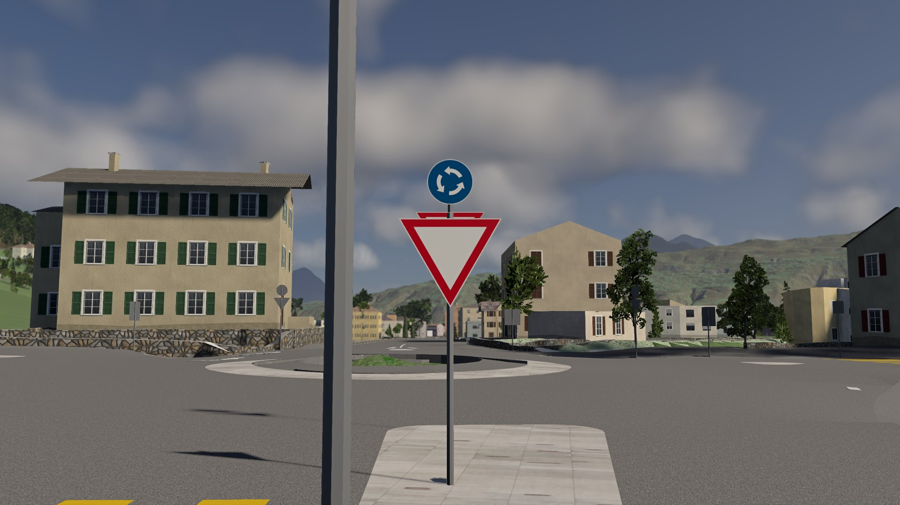<br>*Road signs: roundabout entry* | 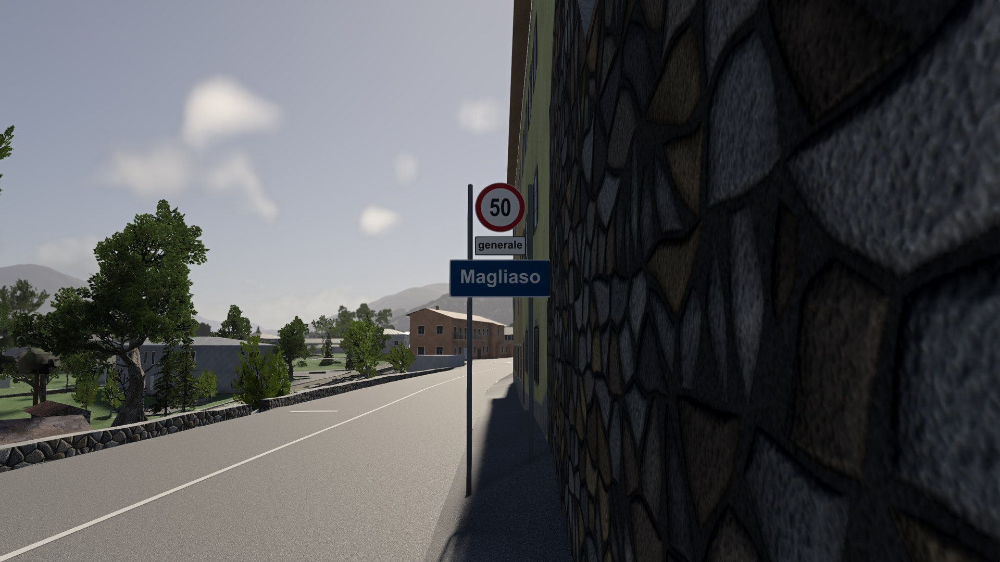<br>*Road signs: the 50 "generale" into Magliaso* |
| 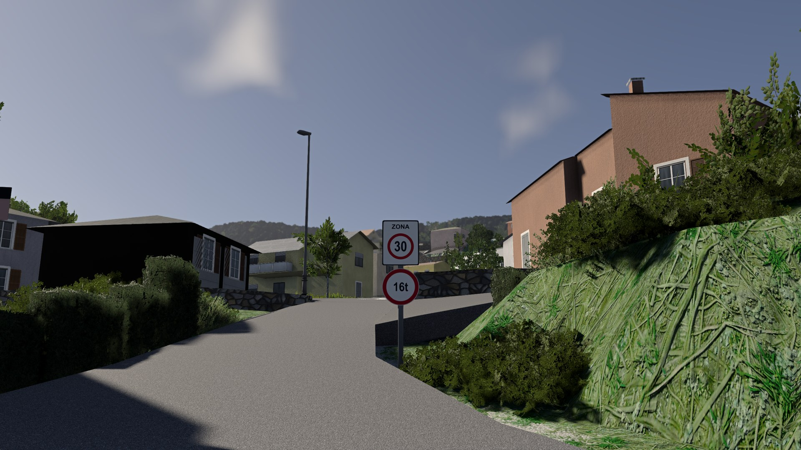<br>*Cantonal road: zone 30 with the 16 t limit, as in the photos* | 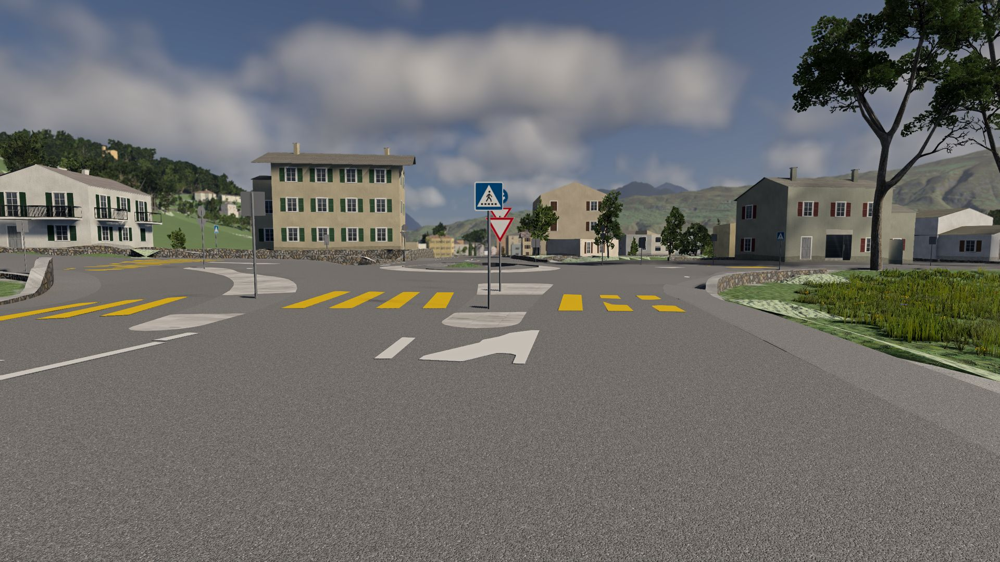<br>*Markings: Swiss pedestrian crossing and arrows* |
| 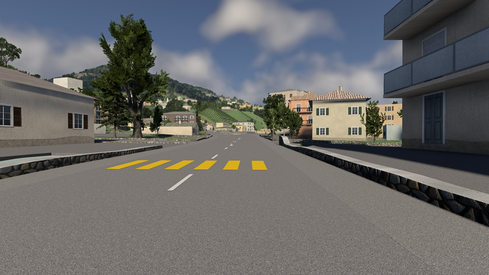<br>*Markings: dashes at one length and period* | 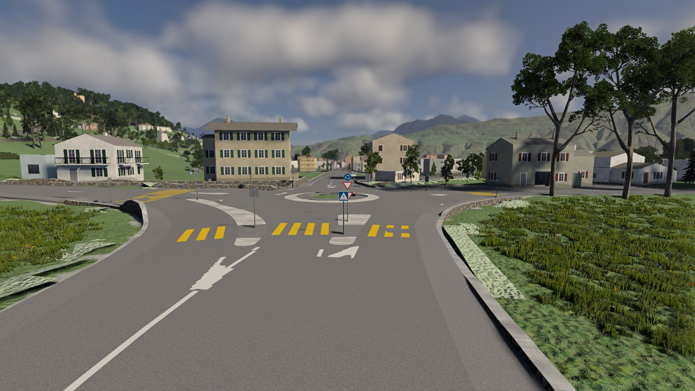<br>*Markings: roundabout* |
| 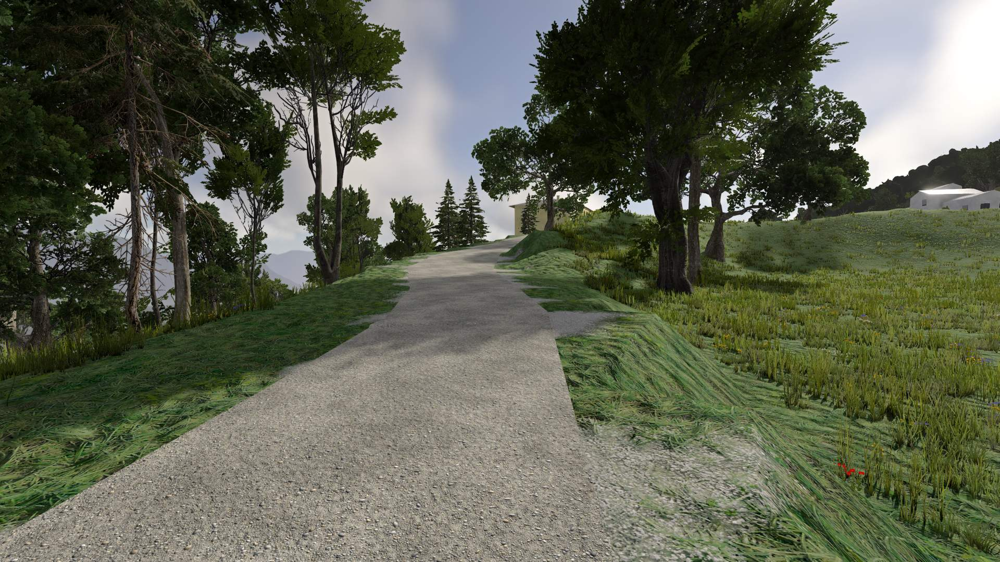<br>*Dirt track above Arosio, flush with the ground* | 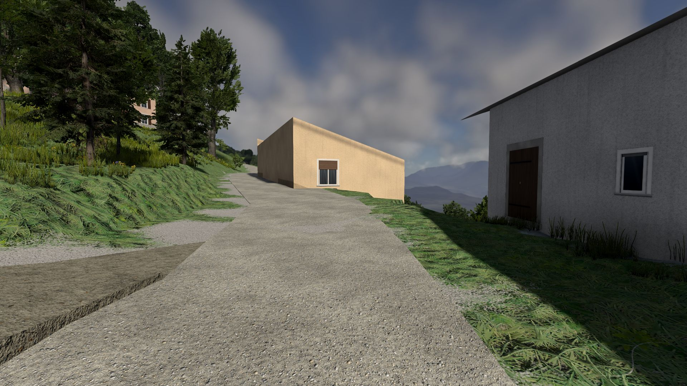<br>*Gravel track at Cademario* |
| 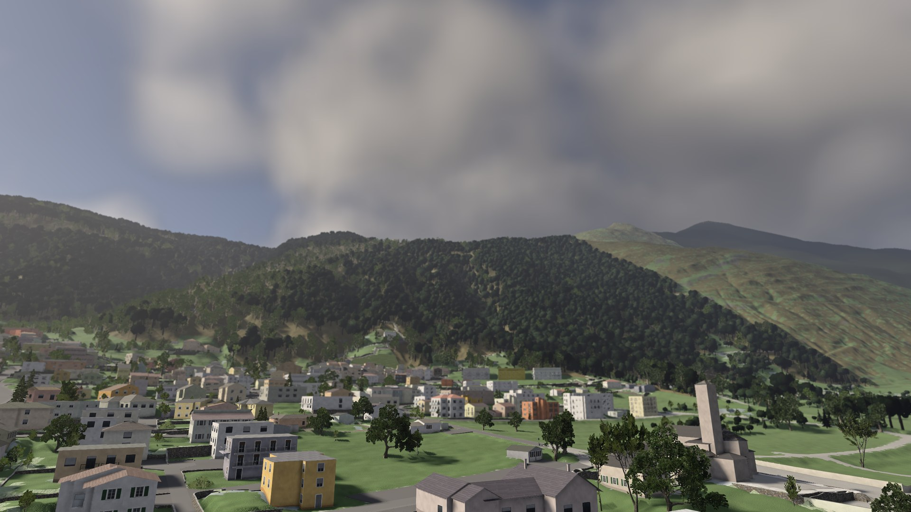<br>*Far trees: the pass above Gravesano from the village* | 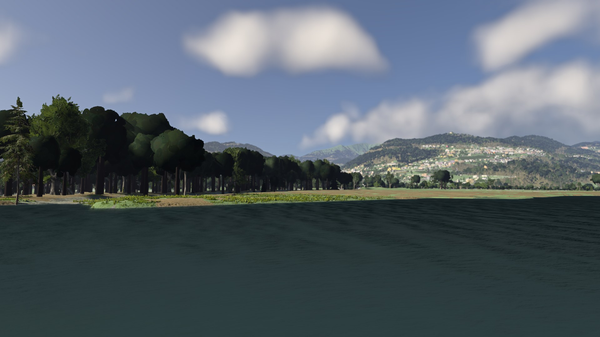<br>*Far trees: the Malcantone from the lake* |

### v2.6

> Screenshots taken in BeamNG.drive 0.39 on the v2.6 level, at the same views as the earlier renders (`beamng/pipeline/run_readme_screenshots.ps1`: free camera, no HUD, the game's own light, sky, vegetation and terrain).

| | |
|---|---|
| <br>*Agno, the old town and the Collegiate Church* | <br>*Cademario* |
| <br>*Novaggio* | <br>*Ponte Tresa, seen from across the border* |
| <br>*Bioggio and Manno, the Vedeggio plain* | <br>*Astano* |
| <br>*Sessa* | <br>*The pass above Gravesano towards Arosio (the Penudria)* |
| <br>*Caslano and Via Torrazza along the lake* | <br>*Magliaso, a street towards the old town* |
| <br>*The cantonal road towards Pura* | <br>*Agno, a street in the old town* |
| <br>*The pass above Gravesano towards Arosio* |  |

## How the map is made

The map is rebuilt from scratch from the data every time: there is no hand-edited level file. In short:

1. **Download the official data** for the area: terrain and surface models, aerial photos, the road network, the cadastral survey, 3D buildings, the building register, OpenStreetMap.
2. **Build the road network.** Every road and trail line is re-centred on the surveyed carriageway, and one least-squares fit computes a smooth height profile for the whole network, so heights match at every junction and gradients are the real ones.
3. **Lay the drivable surfaces** (carriageways, pavements, yards, trails) and carve the terrain 10 cm under them, so it never pokes through a road.
4. **Add everything else:** buildings with drawn façades, walls, bridges, guardrails, road markings detected in the 10 cm aerial photo, trees from the surface model, grass, rivers and the lake, the railway, signs and bus stops.
5. **Write the BeamNG level** with spawn points and the AI road network.
6. **Check it automatically** (`check_level.py`, `drive_test.py`). If the checks fail, no release is published.
7. **Make it lighter for the game** (`optimize_level.py`, since v2.5) and **add the game's grass** (`patch_groundcover.py`, since v2.6).

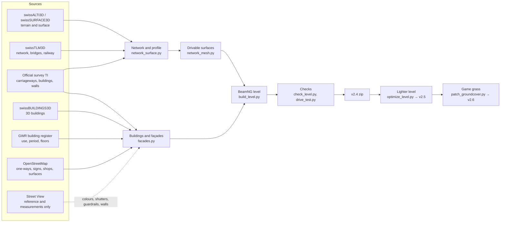

**How a release is built.** The [`release_v2.4.yml`](.github/workflows/release_v2.4.yml) workflow builds the level from scratch on a GitHub server, in about an hour (*Actions* → *Release v2.4* → *Run workflow*): it downloads the data, builds the level, runs the checks and publishes the zip. v2.5 and v2.6 do not rebuild the level: they are patch scripts that run on the previous zip.

```bash
cd beamng/pipeline
python optimize_level.py magliaso_pura_v2.4.zip magliaso_pura_v2.5.zip      # same geometry, lighter for the game
python patch_groundcover.py magliaso_pura_v2.5.zip magliaso_pura_v2.6.zip   # the game's grass and flowers
```

How to run the pipeline yourself, the environment variables, the coordinate system and the role of every script are in [`beamng/README.md`](beamng/README.md).

**Where the numbers come from.** Coordinates are Swiss LV95 shifted to a local origin in the map (1 unit = 1 m), and heights are the real ones above sea level. The Street View panoramas never enter the map: from them the pipeline only takes numbers, like a façade colour, whether a guardrail is there, or what a wall is made of.

## Quality and verification

- **Automatic checks over the whole map** (`check_level.py`, results in [`beamng/verifica/check_level.json`](beamng/verifica/check_level.json)): terrain above the roads, holes, steps, seams between blocks, obstacles on the carriageway searched along every road and trail, trees in the clearance envelope, the AI network, missing files and, since v2.4, building walls facing inwards.
- **Virtual drive test** (`drive_test.py`, [`beamng/verifica/drive_test.json`](beamng/verifica/drive_test.json)): a simulated car (a quarter-car model on all four wheels) drives every road in both directions and every trail, 670 km, on the level's surfaces as written. On the same roads as v2.1 it counts 66 % fewer steps on minor roads (1695 → 570) and 20 % fewer on main roads (74 → 59); wheels lifting off the road drop by 57 % on minor roads and 58 % on main roads, hard hits by 25 % and sharp twists by 61 % on minor roads.
- **Street View review** ([`beamng/verifica/REVISIONE.md`](beamng/verifica/REVISIONE.md)): for every road, the panorama coverage, the measured buildings, the guardrails and walls seen, the drive-test events before and after, and the places compared photo/map from the same camera, with the problems found and the fixes.
- **In the game** (since v2.5): loading time, memory and frame rate measured in BeamNG.drive 0.39.4 at the spawn points and, for v2.6, on meadows and gardens.

## Known limitations

Each limitation has an issue where the details, the places and the possible fix are tracked.

| Limitation | Issue |
|---|---|
| The game needs about 12 GB of memory at its peak (terrain and forest about 7 GB, the meshes the rest). On a 16 GB PC with other programs open it can still stall after loading. | — |
| Not yet reviewed in the game: the river water, the grip of the paving, the street lamp lights at night. | [#8](https://github.com/wintrymichi/magliasinaNG/issues/8) |
| Palms, grass density and vineyard row spacing are estimates. Where OpenStreetMap gives no surface, swissTLM3D applies. | [#9](https://github.com/wintrymichi/magliasinaNG/issues/9) |
| The plinth of a few houses blocks a trail (12 blocked trail points instead of 10, for example in an alley below Pura). | [#10](https://github.com/wintrymichi/magliasinaNG/issues/10) |
| Façades: windows, balconies and doors are plausible but not copied one by one; some colours measured in shadow are wrong; exposed stone, arcades and storey-high plinths are not modelled. | [#11](https://github.com/wintrymichi/magliasinaNG/issues/11) |
| Yards on two levels become steep ramps beside the road (for example in Caslano). | [#12](https://github.com/wintrymichi/magliasinaNG/issues/12) |
| Some buildings have walls under only part of the roof (a shed in Pura). | [#13](https://github.com/wintrymichi/magliasinaNG/issues/13) |
| Guardrails and wall materials only where the panoramas see them; 736 walls stay stone. | [#14](https://github.com/wintrymichi/magliasinaNG/issues/14) |
| The drive test still reports spots to fix: the steep junction in Castelrotto, Via Giuseppe Soldati, the bridge ends on Via Mondonico and Via Roncaccio, the level crossing on Via Grumo, the corridor edges. | [#15](https://github.com/wintrymichi/magliasinaNG/issues/15) |
| The roads added in v2.2 have only a 100 m corridor around them: Arosio and Caslano are only partly included. | [#16](https://github.com/wintrymichi/magliasinaNG/issues/16) |
| Photo/map review: 116 places checked, 20 differences still to be looked at. | [#17](https://github.com/wintrymichi/magliasinaNG/issues/17) |
| On the Italian side there is only terrain and landscape: no roads, buildings or trees beyond the Ponte Tresa border bridge. | [#18](https://github.com/wintrymichi/magliasinaNG/issues/18) |
| Tunnels are not built: roads and the railway stop at the portals. | [#19](https://github.com/wintrymichi/magliasinaNG/issues/19) |
| One-way streets only where OpenStreetMap records them. | [#20](https://github.com/wintrymichi/magliasinaNG/issues/20) |
| Vertical signs only on the Magliaso–Pura cantonal road and where OpenStreetMap records STOP and give-way; no railway overhead line. | [#21](https://github.com/wintrymichi/magliasinaNG/issues/21) |

## Repository layout

| Path | Contents |
|---|---|
| [`beamng/pipeline/`](beamng/pipeline) | the pipeline: data download, road network, surfaces, buildings, façades, vegetation, level, checks, patch scripts; `config.py` holds the paths |
| [`beamng/dati/`](beamng/dati) | small results pinned for the release, so a build doesn't redo the long steps: panorama poses, markings, guardrails, colours, wall materials, GWR and OSM extracts |
| [`beamng/verifica/`](beamng/verifica) | check results, drive test, road-by-road review, screenshots |
| [`beamng/RELEASE_v2.6.md`](beamng/RELEASE_v2.6.md) | the notes published with each release (one file per version) |
| [`.github/workflows/`](.github/workflows) | the release workflows (`release_v2.4.yml` builds the current level from scratch) |
| `panoramas.*`, `cameras.json`, `sv_capture.py`, … | the original dataset of the Magliaso–Pura cantonal road (panorama metadata, see [below](#the-panorama-dataset)) |

## Where to read more

| If you want to… | Read |
|---|---|
| see what changed in each version | [`CHANGELOG.md`](CHANGELOG.md) |
| read the notes of a single release | [`beamng/RELEASE_v2.6.md`](beamng/RELEASE_v2.6.md) and the other `RELEASE_v*.md` |
| run the pipeline, or understand what each script does | [`beamng/README.md`](beamng/README.md) |
| know what's in the level and how accurate it is (this text also ships inside the mod) | [`beamng/pipeline/README_livello.md`](beamng/pipeline/README_livello.md) |
| look at the road-by-road review against Street View | [`beamng/verifica/REVISIONE.md`](beamng/verifica/REVISIONE.md) |
| see the status of every road and village | [`beamng/verifica/STRADE.md`](beamng/verifica/STRADE.md), [`beamng/verifica/ZONE.md`](beamng/verifica/ZONE.md) |

## The panorama dataset

The project started from a dataset of Street View panoramas along the Strada Cantonale from Magliaso to Pura (45.981686, 8.878474 → 46.001760, 8.860159, 3.7 km, almost all from October 2022). **The images are not in the repository**: the `panorami/`, `viste/` and `storici_2013_2014/` folders (9.4 GB) stay local. The repository contains the metadata and the scripts to download them again.

| Folder / file | Contents |
|---|---|
| `panorami/` *(local only)* | 360° equirectangular panoramas, 6656 × 3328, one every ~10 m; named `NNNN_<panoId>.jpg` (NNNN = order along the road) |
| `viste/` *(local only)* | 16 perspective views per panorama (FOV 90°, 1600 × 1200): 8 directions × 2 tilts |
| `panoramas.csv` / `.json` | for each panorama: lat, lon, altitude, date, camera heading, pitch and roll, distance along the road |
| `panoramas.geojson` | panorama positions (opens in QGIS or on geojson.io) |
| `cameras.json` | for each view: file, GPS position, altitude, direction (yaw), pitch, FOV: known poses for photogrammetry |
| `panoramas_all_dates.json` | also the historical panoramas (2013/2014) of the same stretch, not downloaded |
| `sv_capture.py`, `expand.py`, `finalize.py` | the (re-runnable) scripts that download and prepare the images |

The views are named `NNNN_<panoId>_<direction>_p<pitch>.jpg`: the direction is relative to the direction of travel (`fwd`, `fwd_r`, `right`, `back_r`, `back`, `back_l`, `left`, `fwd_l`, in 45° steps), `p00` is the horizon and `p25` looks 25° upwards (façades, roofs, slopes).

**Coverage.** Almost all images are from October 2022; three panoramas from 2013 cover the spots where 2022 is missing. Between 1.28 and 1.36 km from the start (45.9858, 8.8692 → 45.9869, 8.8694) there is a gap of about 110 m with no panoramas on any nearby date. The pole and shadow of the Google car are visible at the bottom of the `p00` views towards `fwd`/`back`.

**3D reconstruction.** The `viste/` work with COLMAP, RealityCapture and Metashape (known intrinsics: fx = fy = 800 px, cx = 800, cy = 600, no distortion; the GPS positions in `cameras.json` serve as georeferencing); Metashape also accepts the spherical panoramas ("Spherical" camera); for Gaussian Splatting or NeRF go through the `viste/` with COLMAP first.

## Sources and licences

- © swisstopo: swissALTI3D, swissSURFACE3D, SWISSIMAGE, swissBUILDINGS3D 3.0, swissTLM3D, swissNAMES3D (open geodata of the Swiss Confederation).
- Official survey: Ufficio del catasto e dei riordini fondiari (Cadastre and Land Consolidation Office), Canton Ticino (geodienste.ch).
- Federal Register of Buildings and Dwellings (Federal Statistical Office).
- © OpenStreetMap contributors, ODbL 1.0: the extracts in `beamng/dati/osm_*.json.gz` are under the ODbL.
- Copernicus DEM GLO-30 (© DLR e.V. / Airbus, provided under COPERNICUS by the EU and ESA): distant landscape.
- Google Street View: visual reference only; no image is distributed.
